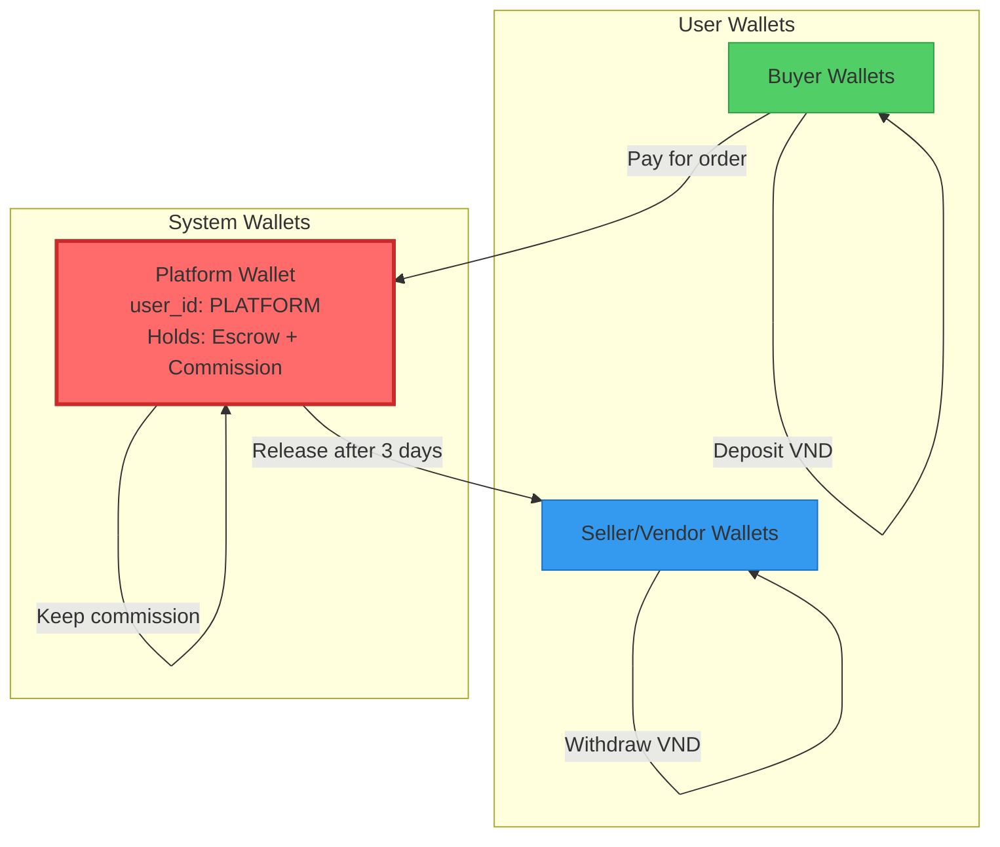
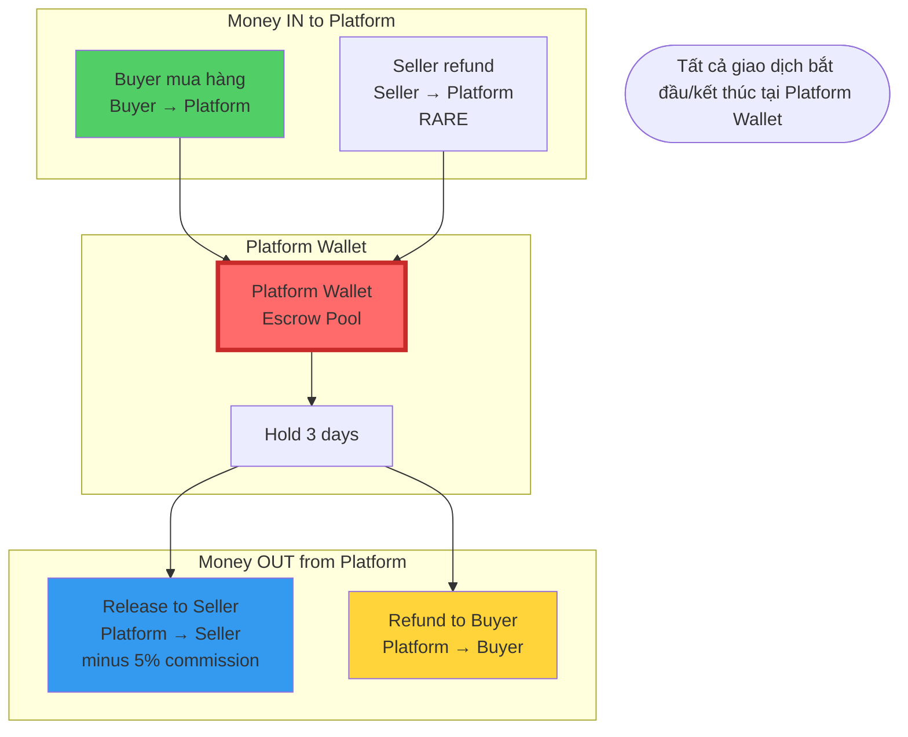
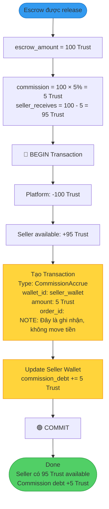

# P2pMMO Wallet V2 - Platform Wallet Architecture

**Document Version:** 3.0
**Created:** 2026-01-01
**Status:** Design Specification
**Language:** Vietnamese (Technical Documentation)

---

## Mục lục

1. [Tổng quan hệ thống](#1-tổng-quan-hệ-thống)
2. [Kiến trúc Platform Wallet](#2-kiến-trúc-platform-wallet)
3. [Deposit Flow - Nạp tiền](#3-deposit-flow---nạp-tiền)
4. [Purchase Flow - Mua hàng](#4-purchase-flow---mua-hàng)
5. [Escrow Flow - Giữ tiền](#5-escrow-flow---giữ-tiền)
6. [Withdrawal Flow - Rút tiền](#6-withdrawal-flow---rút-tiền)
7. [Commission Flow - Hoa hồng](#7-commission-flow---hoa-hồng)
8. [Refund Flow - Hoàn tiền](#8-refund-flow---hoàn-tiền)
9. [Admin Operations - Thao tác quản trị](#9-admin-operations---thao-tác-quản-trị)
10. [Reconciliation - Đối soát hệ thống](#10-reconciliation---đối-soát-hệ-thống)

---

## 1. Tổng quan hệ thống

### 1.1 Nguyên tắc cốt lõi

**Platform Wallet là trung tâm của mọi giao dịch**

```
Buyer Wallet ──→ Platform Wallet ──→ Seller Wallet
                      ↓
                 Commission
```

**Các nguyên tắc:**
1. ✅ **Mọi giao dịch đều qua Platform Wallet** - Không có giao dịch trực tiếp giữa users
2. ✅ **Platform Wallet giữ tiền escrow** - Đảm bảo kiểm soát và bảo mật
3. ✅ **Platform Wallet thu commission** - Tự động khi release escrow
4. ✅ **Audit trail hoàn chỉnh** - Mọi luồng tiền đều có ghi nhận
5. ✅ **Balance luôn đối khớp** - Platform Wallet balance = Tổng escrow + Commission chưa rút

### 1.2 Loại Wallets trong hệ thống



**Chi tiết các loại wallet:**

| Loại | Mô tả | Đặc điểm |
|------|-------|----------|
| **Buyer Wallet** | Ví của người mua | - Chỉ có available_trust<br/>- Không có commission |
| **Seller/Vendor Wallet** | Ví của người bán | - Có available_trust<br/>- Có commission_debt<br/>- Có commission_rate |
| **Platform Wallet** | Ví của sàn (hệ thống) | - user_id = "PLATFORM"<br/>- available_trust = Tổng escrow hiện tại<br/>- Không có escrow_locked (vì chính nó là nơi giữ escrow)<br/>- Thu tất cả commission |

### 1.3 Trust Currency

**Quy đổi cố định:**
- **1000 VND = 1 Trust**
- Chỉ dùng số nguyên, không dùng float
- VND deposit phải chia hết cho 1000

**Ví dụ:**
- Nạp 100,000 VND → Nhận 100 Trust
- Rút 50 Trust → Nhận 50,000 VND (sau khi trừ commission)
- Mua sản phẩm giá 20 Trust → Chuyển 20 Trust từ Buyer → Platform

### 1.4 Wallet Balance States

Mỗi User Wallet có 4 trạng thái số dư:

```
┌─────────────────────────────────────┐
│         TOTAL TRUST                 │
├─────────────────────────────────────┤
│  available_trust        (Dùng ngay) │
│  withdrawal_locked      (Đang rút)  │
│  dispute_locked         (Tranh chấp)│
│─────────────────────────────────────│
│  TOTAL = Sum of above               │
└─────────────────────────────────────┘
```

**Lưu ý:**
- ❌ **User Wallet KHÔNG CÓ escrow_locked_trust**
- ✅ **Escrow được giữ ở Platform Wallet**
- ✅ **Seller chỉ nhận tiền khi Platform Wallet release**

---

## 2. Kiến trúc Platform Wallet

### 2.1 Platform Wallet Data Model

```
Platform Wallet {
    wallet_id: "WLT-PLATFORM"
    user_id: "PLATFORM"
    role: "PLATFORM"

    // Balance chính
    available_trust: <Tổng tiền đang giữ escrow>
    withdrawal_locked: 0         // Platform không rút tiền
    dispute_locked: <Nếu có tranh chấp>
    total_trust: available + dispute_locked

    // Commission tracking
    total_commission_collected: <Tổng commission đã thu>

    // Metadata
    created_at: <timestamp>
    updated_at: <timestamp>
}
```

### 2.2 Platform Wallet Purpose

**Platform Wallet làm gì?**

1. **Giữ tiền escrow cho tất cả orders**
   - Khi buyer mua hàng → Tiền vào Platform Wallet
   - Sau 3 ngày → Platform Wallet trả cho seller

2. **Thu commission tự động**
   - Khi release escrow → Tính 5% commission
   - Commission GIỮ LẠI trong Platform Wallet
   - Không tạo transaction riêng, chỉ ghi nhận

3. **Xử lý refunds**
   - Nếu có tranh chấp → Platform Wallet trả lại buyer
   - Nếu cancel order → Platform Wallet trả lại buyer

4. **Đối soát hệ thống**
   - Platform Wallet balance = Tổng escrow chưa release
   - Nếu không khớp → Có leak hoặc hack

### 2.3 Flow Diagram - Platform Wallet Hub



### 2.4 Platform Wallet Reconciliation Formula

**Công thức đối soát:**

```
Platform_Available_Trust = Σ(All Active Escrows)

Nếu Platform_Available_Trust ≠ Σ(Escrows) → CRITICAL ALERT
```

**Ví dụ:**
- Order #1: 100 Trust đang escrow
- Order #2: 200 Trust đang escrow
- Order #3: 50 Trust đang escrow
- **→ Platform Wallet phải có available_trust = 350 Trust**

Nếu Platform có 340 Trust → Thiếu 10 Trust → **BÁO ĐỘNG**

---

## 3. Deposit Flow - Nạp tiền

### 3.1 Overview

**Mục đích:** User nạp VND từ ngân hàng → Nhận Trust vào wallet

**2 loại deposit:**
1. **Auto Deposit** - User tự nạp qua payment gateway (VNPay, MoMo)
2. **Manual Deposit** - Admin nạp trực tiếp Trust cho user

### 3.2 Auto Deposit Flow

```mermaid
flowchart TD
    Start([User nhấn "Nạp tiền"])

    %% Input Phase
    Start --> ShowForm[Hiển thị form deposit]
    ShowForm --> UserInput[User nhập số tiền VND<br/>Ví dụ: 100,000 VND]

    %% Validation Phase
    UserInput --> Validate{Validate input}
    Validate -->|FAIL| Error1[❌ Error:<br/>- Min 10,000 VND<br/>- Max 50,000,000 VND<br/>- Phải chia hết cho 1,000]
    Validate -->|PASS| CalcTrust[Tính Trust<br/>trust = vnd ÷ 1,000<br/>100,000 ÷ 1,000 = 100 Trust]

    %% Create Request Phase
    CalcTrust --> CreateReq[Tạo DepositRequest<br/>status: PENDING<br/>vnd: 100,000<br/>trust: 100]
    CreateReq --> ChooseGateway{User chọn cổng thanh toán}
    ChooseGateway --> VNPay[VNPay]
    ChooseGateway --> MoMo[MoMo]

    %% Payment Gateway Phase
    VNPay --> CallAPI[Gọi VNPay API<br/>tạo payment_url]
    MoMo --> CallAPI
    CallAPI --> SaveURL[Lưu payment_url vào request<br/>expires_at: now + 15 phút]
    SaveURL --> Redirect[Redirect user đến payment_url]

    %% User Payment Phase
    Redirect --> UserPays[User thanh toán trên VNPay/MoMo]
    UserPays --> Gateway{Gateway xử lý}
    Gateway -->|Success| Webhook[Gateway gửi webhook notification]
    Gateway -->|Cancel| CancelReq[User cancel<br/>Status: CANCELLED]
    Gateway -->|Timeout 15 min| ExpireReq[Timeout<br/>Status: EXPIRED]

    %% Webhook Processing Phase
    Webhook --> ValidateWebhook{Validate webhook}
    ValidateWebhook -->|Invalid signature| Reject[❌ Reject webhook<br/>Log suspicious activity]
    ValidateWebhook -->|Valid| CheckIdempotent{Đã xử lý webhook này?}
    CheckIdempotent -->|Yes| Return200[Return 200 OK<br/>Idempotent - không xử lý lại]
    CheckIdempotent -->|No| BeginTx[🔵 BEGIN Database Transaction]

    %% Transaction Creation Phase
    BeginTx --> CreateTx1[Tạo Transaction #1<br/>Type: DepositVND<br/>amount: 0 Trust<br/>vnd_amount: 100,000<br/>description: Received VND from gateway]
    CreateTx1 --> CreateTx2[Tạo Transaction #2<br/>Type: DepositConvert<br/>amount: +100 Trust<br/>vnd_amount: 100,000<br/>balance_before: old_balance<br/>balance_after: old + 100]

    %% Update Wallet Phase
    CreateTx2 --> UpdateWallet[Cập nhật User Wallet<br/>available_trust += 100<br/>total_trust += 100]
    UpdateWallet --> UpdateReq[Cập nhật DepositRequest<br/>status: COMPLETED<br/>completed_at: now]
    UpdateReq --> CommitTx[🟢 COMMIT Transaction]

    %% Notification Phase
    CommitTx --> InvalidateCache[Xóa cache của wallet]
    InvalidateCache --> Notify[Gửi notification cho user<br/>"Nạp 100,000 VND thành công<br/>Bạn nhận được 100 Trust"]
    Notify --> End([Done])

    style Start fill:#51cf66,stroke:#2f9e44
    style End fill:#51cf66,stroke:#2f9e44
    style BeginTx fill:#339af0,stroke:#1971c2
    style CommitTx fill:#51cf66,stroke:#2f9e44
    style Error1 fill:#ff6b6b,stroke:#c92a2a
    style Reject fill:#ff6b6b,stroke:#c92a2a
    style CancelReq fill:#ffd43b,stroke:#f08c00
    style ExpireReq fill:#ffd43b,stroke:#f08c00
```

### 3.3 Auto Deposit Conditions

| # | Condition | Error Message |
|---|-----------|---------------|
| **C3.1** | amount >= 10,000 VND | "Số tiền nạp tối thiểu 10,000 VND" |
| **C3.2** | amount <= 50,000,000 VND | "Số tiền nạp tối đa 50,000,000 VND" |
| **C3.3** | amount % 1,000 == 0 | "Số tiền phải chia hết cho 1,000 VND" |
| **C3.4** | Wallet status == ACTIVE | "Ví của bạn đang bị khóa, liên hệ admin" |
| **C3.5** | Payment gateway available | "Cổng thanh toán tạm thời không khả dụng" |
| **C3.6** | Webhook signature valid | (Internal) Reject webhook |
| **C3.7** | DepositRequest exists | (Internal) 404 not found |
| **C3.8** | DepositRequest status == PENDING | (Internal) Already processed (idempotent) |
| **C3.9** | payment_gateway_ref unique | (Internal) Duplicate transaction |
| **C3.10** | VND amount matches webhook | (Internal) Amount mismatch - possible fraud |

### 3.4 Manual Deposit Flow (Admin)

```mermaid
flowchart TD
    Start([Admin nạp tiền cho user])

    %% Selection Phase
    Start --> SelectUser[Admin chọn user cần nạp tiền]
    SelectUser --> ShowForm[Hiển thị form manual deposit]

    %% Input Phase
    ShowForm --> AdminInput[Admin nhập:<br/>- Số Trust cần nạp<br/>- Lý do<br/>- Note]

    %% Validation Phase
    AdminInput --> Validate{Validate}
    Validate -->|FAIL| Error[❌ Error:<br/>- Trust > 0<br/>- Trust <= 1,000,000<br/>- Lý do bắt buộc]
    Validate -->|PASS| CheckPerm{Admin có permission<br/>WALLET_DEPOSIT?}
    CheckPerm -->|No| PermError[❌ "Không có quyền thực hiện"]
    CheckPerm -->|Yes| Confirm{Admin xác nhận}
    Confirm -->|Cancel| CancelOp[Hủy thao tác]
    Confirm -->|Confirm| BeginTx[🔵 BEGIN Transaction]

    %% Transaction Phase
    BeginTx --> CreateTx[Tạo Transaction<br/>Type: DepositManual<br/>amount: +<trust><br/>admin_id: <admin_id><br/>description: <lý do>]
    CreateTx --> UpdateWallet[Cập nhật User Wallet<br/>available_trust += <trust><br/>total_trust += <trust>]
    UpdateWallet --> CreateAudit[Tạo AuditLog<br/>action: ADMIN_DEPOSIT<br/>admin_id: <admin_id><br/>target_user: <user_id><br/>amount: <trust><br/>reason: <lý do>]
    CreateAudit --> CommitTx[🟢 COMMIT Transaction]

    %% Notification Phase
    CommitTx --> InvalidateCache[Xóa cache]
    InvalidateCache --> NotifyUser[Gửi email cho user<br/>"Admin đã nạp X Trust vào ví của bạn"]
    NotifyUser --> NotifyAdmin[Log hành động admin]
    NotifyAdmin --> End([Done])

    style Start fill:#339af0,stroke:#1971c2
    style End fill:#51cf66,stroke:#2f9e44
    style BeginTx fill:#339af0,stroke:#1971c2
    style CommitTx fill:#51cf66,stroke:#2f9e44
    style Error fill:#ff6b6b,stroke:#c92a2a
    style PermError fill:#ff6b6b,stroke:#c92a2a
```

### 3.5 Manual Deposit Conditions

| # | Condition | Error Message |
|---|-----------|---------------|
| **C3.11** | trust_amount > 0 | "Số Trust phải lớn hơn 0" |
| **C3.12** | trust_amount <= 1,000,000 | "Số Trust nạp tối đa 1,000,000 (liên hệ supervisor nếu cần nạp nhiều hơn)" |
| **C3.13** | reason.length >= 10 | "Lý do nạp tiền phải ít nhất 10 ký tự" |
| **C3.14** | Admin has WALLET_DEPOSIT permission | "Bạn không có quyền nạp tiền" |
| **C3.15** | Target wallet exists | "Không tìm thấy ví của user này" |
| **C3.16** | Target wallet status == ACTIVE | "Ví này đang bị khóa, không thể nạp tiền" |

### 3.6 Deposit Business Rules

| # | Rule |
|---|------|
| **BR3.1** | Auto deposit tạo 2 transactions: DepositVND (0 Trust) + DepositConvert (+Trust) |
| **BR3.2** | Manual deposit chỉ tạo 1 transaction: DepositManual (+Trust) |
| **BR3.3** | Payment URL hết hạn sau 15 phút |
| **BR3.4** | Webhook phải xử lý idempotent (có thể nhận nhiều lần cùng 1 webhook) |
| **BR3.5** | Deposit KHÔNG ảnh hưởng đến Platform Wallet (tiền vào User Wallet trực tiếp) |
| **BR3.6** | Mọi manual deposit phải ghi audit log với admin_id |
| **BR3.7** | User nhận notification qua email + in-app khi deposit thành công |
| **BR3.8** | Nếu webhook nhận sai amount → Reject và tạo alert cho admin kiểm tra |

---

## 4. Purchase Flow - Mua hàng

### 4.1 Overview

**Khi buyer mua sản phẩm:**
1. Tiền trừ từ Buyer Wallet (available_trust)
2. Tiền chuyển vào **Platform Wallet** (NOT Seller Wallet)
3. Platform giữ tiền trong 3 ngày (escrow)
4. Sau 3 ngày tự động release cho seller (xem [Section 5](#5-escrow-flow---giữ-tiền))

**Key point:**
- ❌ Seller KHÔNG nhận tiền ngay
- ✅ Platform Wallet giữ tiền
- ✅ Buyer được bảo vệ trong 3 ngày

### 4.2 Purchase Flow Diagram

```mermaid
flowchart TD
    Start([User nhấn "Mua hàng"])

    %% Order Creation
    Start --> CreateOrder[Tạo Order<br/>product_id, quantity, price<br/>total_amount_trust = price × qty]
    CreateOrder --> CheckStock{Kiểm tra tồn kho}
    CheckStock -->|Out of stock| ErrorStock[❌ "Sản phẩm hết hàng"]
    CheckStock -->|Available| GetBuyerWallet[Lấy Buyer Wallet]

    %% Balance Check
    GetBuyerWallet --> CheckBalance{available_trust >= total_amount?}
    CheckBalance -->|No| ErrorBalance[❌ "Số dư không đủ<br/>Vui lòng nạp thêm tiền"]
    CheckBalance -->|Yes| GetPlatformWallet[Lấy Platform Wallet]

    %% Transaction Phase
    GetPlatformWallet --> BeginTx[🔵 BEGIN Transaction]
    BeginTx --> DeductBuyer[Tạo Transaction cho Buyer<br/>Type: Purchase<br/>amount: -total_amount<br/>order_id: <order_id>]
    DeductBuyer --> UpdateBuyerWallet[Update Buyer Wallet<br/>available_trust -= total_amount<br/>total_trust -= total_amount]

    UpdateBuyerWallet --> CreditPlatform[Tạo Transaction cho Platform<br/>Type: PurchaseReceived<br/>amount: +total_amount<br/>order_id: <order_id>]
    CreditPlatform --> UpdatePlatformWallet[Update Platform Wallet<br/>available_trust += total_amount<br/>total_trust += total_amount]

    UpdatePlatformWallet --> CreateEscrow[Tạo EscrowHold<br/>amount: total_amount<br/>buyer_id, seller_id, order_id<br/>status: HOLDING<br/>release_at: now + 3 days]
    CreateEscrow --> UpdateOrder[Update Order<br/>payment_status: PAID<br/>escrow_hold_id: <escrow_id>]

    UpdateOrder --> CommitTx[🟢 COMMIT Transaction]

    %% Post-transaction
    CommitTx --> InvalidateCache[Xóa cache Buyer + Platform wallets]
    InvalidateCache --> NotifyBuyer[Notify Buyer:<br/>"Thanh toán thành công<br/>Đơn hàng đang xử lý"]
    NotifyBuyer --> NotifySeller[Notify Seller:<br/>"Bạn có đơn hàng mới<br/>Tiền đang giữ escrow"]
    NotifySeller --> End([Done<br/>Tiền đang ở Platform Wallet])

    style Start fill:#51cf66,stroke:#2f9e44
    style End fill:#51cf66,stroke:#2f9e44
    style BeginTx fill:#339af0,stroke:#1971c2
    style CommitTx fill:#51cf66,stroke:#2f9e44
    style ErrorStock fill:#ff6b6b,stroke:#c92a2a
    style ErrorBalance fill:#ff6b6b,stroke:#c92a2a
    style CreateEscrow fill:#ffd43b,stroke:#f08c00
    style UpdatePlatformWallet fill:#ff6b6b,stroke:#c92a2a,stroke-width:3px
```

### 4.3 Purchase Conditions

| # | Condition | Error Message |
|---|-----------|---------------|
| **C4.1** | Product exists | "Sản phẩm không tồn tại" |
| **C4.2** | Product status == ACTIVE | "Sản phẩm không còn bán" |
| **C4.3** | stock >= quantity | "Số lượng vượt quá tồn kho" |
| **C4.4** | Buyer wallet status == ACTIVE | "Ví của bạn đang bị khóa" |
| **C4.5** | buyer_available_trust >= total_amount | "Số dư không đủ, vui lòng nạp thêm" |
| **C4.6** | Platform wallet exists | (Internal) "Platform wallet not found - critical error" |
| **C4.7** | Buyer ≠ Seller | "Không thể mua sản phẩm của chính mình" |

### 4.4 Purchase Business Rules

| # | Rule |
|---|------|
| **BR4.1** | Mọi purchase tạo 2 transactions: Buyer deduct (-) + Platform credit (+) |
| **BR4.2** | Tiền VÀO Platform Wallet, KHÔNG vào Seller Wallet |
| **BR4.3** | Tạo EscrowHold record với release_at = now + 3 days |
| **BR4.4** | Order payment_status chuyển từ PENDING → PAID |
| **BR4.5** | Buyer và Seller đều nhận notification |
| **BR4.6** | Nếu transaction fail → Rollback toàn bộ (order vẫn PENDING, stock không giảm) |
| **BR4.7** | Platform Wallet balance tăng = Số escrow đang hold tăng |

---

## 5. Escrow Flow - Giữ tiền

### 5.1 Overview

**Escrow System giữ tiền trong Platform Wallet để:**
- ✅ Bảo vệ buyer (có 3 ngày để khiếu nại)
- ✅ Đảm bảo seller nhận tiền sau khi hoàn thành đơn
- ✅ Platform kiểm soát luồng tiền

**3 kịch bản:**
1. **Auto-release (happy path):** Sau 3 ngày tự động chuyển tiền cho seller
2. **Early release:** Buyer xác nhận nhận hàng sớm → Release trước 3 ngày
3. **Dispute:** Có tranh chấp → Admin can thiệp

### 5.2 Escrow Auto-Release Flow

```mermaid
flowchart TD
    Start([Cron job chạy mỗi giờ])

    %% Query Phase
    Start --> Query[Query tất cả EscrowHolds<br/>WHERE status = HOLDING<br/>AND release_at <= NOW]
    Query --> CheckResults{Có escrows cần release?}
    CheckResults -->|No| End1([No action])
    CheckResults -->|Yes| Loop[Lặp qua từng escrow]

    %% Processing Each Escrow
    Loop --> GetEscrow[Lấy escrow record]
    GetEscrow --> GetOrder[Lấy Order info<br/>order_id, seller_id, amount]
    GetOrder --> CalcCommission[Tính Commission<br/>commission = amount × 5%<br/>seller_receives = amount × 95%]

    %% Validation
    CalcCommission --> GetWallets[Lấy Platform + Seller wallets]
    GetWallets --> ValidatePlatform{Platform có đủ tiền?}
    ValidatePlatform -->|No| AlertCritical[🚨 CRITICAL ALERT<br/>Platform wallet thiếu tiền<br/>Possible leak!]
    ValidatePlatform -->|Yes| BeginTx[🔵 BEGIN Transaction]

    %% Release Transactions
    BeginTx --> DeductPlatform[Transaction cho Platform<br/>Type: EscrowReleasePlatform<br/>amount: -amount<br/>(Trả lại toàn bộ escrow)]
    DeductPlatform --> UpdatePlatformWallet[Update Platform Wallet<br/>available_trust -= amount<br/>total_trust -= amount]

    UpdatePlatformWallet --> CreditSeller[Transaction cho Seller<br/>Type: EscrowReleaseSeller<br/>amount: +seller_receives<br/>order_id, escrow_id]
    CreditSeller --> UpdateSellerWallet[Update Seller Wallet<br/>available_trust += seller_receives<br/>total_trust += seller_receives]

    %% Commission Tracking
    UpdateSellerWallet --> AccrueCommission[Tạo Commission Transaction<br/>Type: CommissionAccrue<br/>wallet_id: seller_wallet<br/>amount: commission<br/>Ghi nhận commission_debt]
    AccrueCommission --> UpdateCommissionDebt[Update Seller Wallet<br/>commission_debt += commission]

    %% Platform Commission Record
    UpdateCommissionDebt --> RecordPlatformCommission[Tạo Transaction cho Platform<br/>Type: CommissionCollected<br/>amount: +commission<br/>seller_id, order_id]
    RecordPlatformCommission --> UpdatePlatformCommission[Update Platform Wallet<br/>total_commission_collected += commission]

    %% Finalize
    UpdatePlatformCommission --> UpdateEscrow[Update EscrowHold<br/>status: RELEASED<br/>released_at: NOW<br/>commission_amount: commission]
    UpdateEscrow --> UpdateOrder[Update Order<br/>escrow_status: RELEASED]
    UpdateOrder --> CommitTx[🟢 COMMIT Transaction]

    %% Post-processing
    CommitTx --> InvalidateCache[Xóa cache Platform + Seller]
    InvalidateCache --> NotifySeller[Notify Seller:<br/>"Bạn nhận X Trust từ đơn hàng #Y<br/>Commission: Z Trust"]
    NotifySeller --> HasMore{Còn escrow khác?}
    HasMore -->|Yes| Loop
    HasMore -->|No| End2([Done])

    style Start fill:#339af0,stroke:#1971c2
    style End1 fill:#868e96,stroke:#495057
    style End2 fill:#51cf66,stroke:#2f9e44
    style BeginTx fill:#339af0,stroke:#1971c2
    style CommitTx fill:#51cf66,stroke:#2f9e44
    style AlertCritical fill:#ff6b6b,stroke:#c92a2a,stroke-width:3px
    style CalcCommission fill:#ffd43b,stroke:#f08c00
    style AccrueCommission fill:#ffd43b,stroke:#f08c00
```

### 5.3 Escrow Early Release Flow (Buyer confirms)

```mermaid
flowchart TD
    Start([Buyer nhấn "Đã nhận hàng"])

    %% Validation
    Start --> GetOrder[Lấy Order info]
    GetOrder --> CheckBuyer{order.buyer_id == current_user?}
    CheckBuyer -->|No| Error1[❌ "Không phải đơn hàng của bạn"]
    CheckBuyer -->|Yes| CheckStatus{order.escrow_status == HOLDING?}
    CheckStatus -->|No| Error2[❌ "Đơn hàng không trong trạng thái escrow"]
    CheckStatus -->|Yes| GetEscrow[Lấy EscrowHold]

    GetEscrow --> Confirm{Buyer xác nhận}
    Confirm -->|Cancel| CancelOp[Hủy thao tác]
    Confirm -->|Confirm| UpdateEscrowTime[Update EscrowHold<br/>release_at = NOW<br/>early_release = true<br/>early_release_by: buyer_id]

    %% Trigger Release
    UpdateEscrowTime --> TriggerRelease[Trigger release process<br/>Chạy logic giống Auto-release]
    TriggerRelease --> CalcCommission[Tính commission 5%]
    CalcCommission --> BeginTx[🔵 BEGIN Transaction]

    %% Same as auto-release
    BeginTx --> DeductPlatform[Platform: -amount]
    DeductPlatform --> CreditSeller[Seller: +95%]
    CreditSeller --> AccrueCommission[Commission debt: +5%]
    AccrueCommission --> CommitTx[🟢 COMMIT]

    CommitTx --> NotifyBuyer[Notify Buyer:<br/>"Cảm ơn bạn đã xác nhận"]
    NotifyBuyer --> NotifySeller[Notify Seller:<br/>"Buyer đã xác nhận sớm<br/>Bạn nhận X Trust"]
    NotifySeller --> End([Done])

    style Start fill:#51cf66,stroke:#2f9e44
    style End fill:#51cf66,stroke:#2f9e44
    style Error1 fill:#ff6b6b,stroke:#c92a2a
    style Error2 fill:#ff6b6b,stroke:#c92a2a
```

### 5.4 Escrow Conditions

| # | Condition | Error Message |
|---|-----------|---------------|
| **C5.1** | EscrowHold status == HOLDING | (Internal) "Escrow already released/disputed" |
| **C5.2** | release_at <= NOW (for auto-release) | (Internal) Not yet time to release |
| **C5.3** | Platform available_trust >= escrow_amount | 🚨 CRITICAL: Platform wallet leak detected |
| **C5.4** | Seller wallet exists | (Internal) "Seller wallet not found" |
| **C5.5** | Seller wallet status == ACTIVE | Hold escrow, notify admin "Seller wallet suspended" |
| **C5.6** | For early release: buyer_id == order.buyer_id | "Không phải đơn hàng của bạn" |
| **C5.7** | For early release: escrow_status == HOLDING | "Đơn hàng không trong trạng thái escrow" |

### 5.5 Escrow Business Rules

| # | Rule |
|---|------|
| **BR5.1** | Escrow hold duration: 3 days (72 hours) |
| **BR5.2** | Auto-release chạy mỗi giờ bởi cron job |
| **BR5.3** | Commission rate: 5% cố định (sẽ tách module sau) |
| **BR5.4** | Commission KHÔNG trừ từ Platform, chỉ ghi nhận vào seller's commission_debt |
| **BR5.5** | Platform nhận commission bằng cách: Deduct Platform 100% → Credit Seller 95% → Chênh lệch 5% = commission |
| **BR5.6** | Nếu Platform wallet thiếu tiền → Dừng release, alert admin CRITICAL |
| **BR5.7** | Early release chỉ buyer mới được thực hiện |
| **BR5.8** | Commission_debt tăng khi release escrow, giảm khi seller withdraw |
| **BR5.9** | Platform Wallet balance giảm khi release = Escrow giảm |

---

## 6. Withdrawal Flow - Rút tiền

### 6.1 Overview

**Khi seller rút tiền:**
1. Seller request rút X Trust
2. Hệ thống khóa X Trust (available → withdrawal_locked)
3. Background job validate (balance check + fraud check)
4. Tính commission cần trừ từ commission_debt
5. Chuyển khoản VND cho seller (số Trust × 1000 - commission)
6. Commission về Platform Wallet

**Key points:**
- ✅ Commission trừ khi rút tiền (KHÔNG phải khi release escrow)
- ✅ Seller rút 100 Trust, có commission_debt 5 Trust → Nhận 95,000 VND, debt giảm 5 Trust
- ✅ Platform Wallet tăng 5 Trust từ commission

### 6.2 Withdrawal Request Flow

```mermaid
flowchart TD
    Start([Seller nhấn "Rút tiền"])

    %% Input Phase
    Start --> ShowForm[Hiển thị form withdrawal]
    ShowForm --> ShowInfo[Hiển thị info:<br/>- Available: X Trust<br/>- Commission debt: Y Trust<br/>- Ước tính nhận: X×1000 - Y×1000 VND]
    ShowInfo --> UserInput[Seller nhập:<br/>- Số Trust muốn rút<br/>- Thông tin ngân hàng]

    %% Validation Phase
    UserInput --> Validate{Validate}
    Validate -->|FAIL| Error1[❌ Errors:<br/>- Min 10 Trust<br/>- Max 100,000 Trust/lần<br/>- available >= amount<br/>- Bank info đầy đủ]
    Validate -->|PASS| CalcActual[Tính số tiền thực nhận:<br/>commission_to_deduct = min(amount×5%, commission_debt)<br/>actual_trust = amount - commission_to_deduct<br/>vnd_amount = actual_trust × 1000]

    CalcActual --> ShowConfirm[Hiển thị xác nhận:<br/>"Rút: {amount} Trust<br/>Commission trừ: {commission_to_deduct} Trust<br/>Nhận về: {vnd_amount} VND"]
    ShowConfirm --> UserConfirm{Seller xác nhận?}
    UserConfirm -->|Cancel| CancelOp[Hủy thao tác]
    UserConfirm -->|Confirm| BeginTx[🔵 BEGIN Transaction]

    %% Lock Funds Phase
    BeginTx --> CreateRequest[Tạo WithdrawalRequest<br/>status: PENDING<br/>trust_amount: amount<br/>commission_deduct: commission_to_deduct<br/>vnd_amount: vnd_amount]
    CreateRequest --> LockFunds[Tạo Transaction<br/>Type: WithdrawalLock<br/>amount: -amount<br/>Move từ available → withdrawal_locked]
    LockFunds --> UpdateWallet[Update Seller Wallet<br/>available_trust -= amount<br/>withdrawal_locked_trust += amount<br/>(total không đổi)]
    UpdateWallet --> CommitTx[🟢 COMMIT Transaction]

    %% Enqueue Background Job
    CommitTx --> EnqueueJob[Enqueue background job<br/>validate_withdrawal<br/>request_id: <id>]
    EnqueueJob --> ResponseUser[Response to user:<br/>"Yêu cầu rút tiền đang xử lý<br/>Chúng tôi sẽ thông báo kết quả"]
    ResponseUser --> End1([User sees PENDING status])

    %% Background Validation Job (Async)
    EnqueueJob -.->|Background| BG_Start([Background Job Started])
    BG_Start --> BG_Validate[Run validation:<br/>1. Balance integrity check<br/>2. Fraud pattern check<br/>3. Daily limit check]

    BG_Validate --> BG_Check{Validation result?}
    BG_Check -->|FAIL| BG_Reject[Update request: REJECTED<br/>Unlock funds back to available]
    BG_Check -->|PASS - Manual review| BG_ManualReview[Update: PENDING_REVIEW<br/>Notify admin<br/>Keep funds locked]
    BG_Check -->|PASS - Auto approve| BG_Approve[Update request: APPROVED<br/>Enqueue transfer job]

    BG_Reject --> BG_NotifyReject[Notify seller:<br/>"Yêu cầu bị từ chối: {reason}"]
    BG_ManualReview --> BG_NotifyReview[Notify seller:<br/>"Đang chờ xét duyệt"]
    BG_Approve --> BG_NotifyApprove[Notify seller:<br/>"Đã duyệt, đang chuyển khoản"]

    style Start fill:#339af0,stroke:#1971c2
    style End1 fill:#ffd43b,stroke:#f08c00
    style BeginTx fill:#339af0,stroke:#1971c2
    style CommitTx fill:#51cf66,stroke:#2f9e44
    style Error1 fill:#ff6b6b,stroke:#c92a2a
    style BG_Start fill:#e599f7,stroke:#9c36b5
    style BG_Reject fill:#ff6b6b,stroke:#c92a2a
    style BG_Approve fill:#51cf66,stroke:#2f9e44
```

### 6.3 Withdrawal Processing Flow (After Approval)

```mermaid
flowchart TD
    Start([Withdrawal APPROVED<br/>Bắt đầu transfer job])

    %% Get Info
    Start --> GetRequest[Lấy WithdrawalRequest<br/>trust_amount, commission_deduct, vnd_amount<br/>bank_info]
    GetRequest --> GetWallets[Lấy Seller + Platform wallets]

    %% Bank Transfer
    GetWallets --> CallBankAPI[Gọi Bank Transfer API<br/>amount: vnd_amount<br/>bank_account: seller's bank]
    CallBankAPI --> BankResult{Bank transfer result}
    BankResult -->|FAIL| HandleFail[Retry logic<br/>Max 3 retries<br/>Exponential backoff]
    HandleFail --> RetryCheck{Retry success?}
    RetryCheck -->|No| FailFinal[Update request: FAILED<br/>Unlock funds<br/>Notify seller]
    RetryCheck -->|Yes| BankSuccess
    BankResult -->|SUCCESS| BankSuccess[Nhận bank transfer ref]

    %% Complete Withdrawal Transaction
    BankSuccess --> BeginTx[🔵 BEGIN Transaction]
    BeginTx --> CompleteWithdrawal[Transaction Seller<br/>Type: WithdrawalComplete<br/>amount: -trust_amount<br/>Deduct from withdrawal_locked]
    CompleteWithdrawal --> UpdateSellerWallet[Update Seller Wallet<br/>withdrawal_locked_trust -= trust_amount<br/>total_trust -= trust_amount<br/>commission_debt -= commission_deduct]

    %% Commission to Platform
    UpdateSellerWallet --> CommissionTx[Transaction Platform<br/>Type: CommissionCollected<br/>amount: +commission_deduct<br/>seller_id, withdrawal_id]
    CommissionTx --> UpdatePlatformWallet[Update Platform Wallet<br/>available_trust += commission_deduct<br/>total_trust += commission_deduct<br/>total_commission_collected += commission_deduct]

    %% Finalize
    UpdatePlatformWallet --> UpdateRequest[Update WithdrawalRequest<br/>status: COMPLETED<br/>completed_at: NOW<br/>bank_ref: <ref>]
    UpdateRequest --> CommitTx[🟢 COMMIT Transaction]

    %% Notification
    CommitTx --> InvalidateCache[Xóa cache Seller + Platform]
    InvalidateCache --> NotifySeller[Notify Seller:<br/>"Rút {trust_amount} Trust thành công<br/>Commission: {commission_deduct} Trust<br/>Đã chuyển {vnd_amount} VND<br/>Ref: {bank_ref}"]
    NotifySeller --> End([Done])

    style Start fill:#339af0,stroke:#1971c2
    style End fill:#51cf66,stroke:#2f9e44
    style BeginTx fill:#339af0,stroke:#1971c2
    style CommitTx fill:#51cf66,stroke:#2f9e44
    style FailFinal fill:#ff6b6b,stroke:#c92a2a
    style CommissionTx fill:#ffd43b,stroke:#f08c00
```

### 6.4 Withdrawal Validation Details

**Background validation job kiểm tra 3 điều:**

**1. Balance Integrity Check:**
```
Lấy snapshot tháng trước (verified balance)
Tính: calculated_balance = snapshot + Σ(credits this month) - Σ(debits this month)

If calculated_balance != wallet.total_trust:
    → REJECT: "Phát hiện bất thường trong giao dịch, vui lòng liên hệ support"
```

**2. Fraud Pattern Check:**
```
Risk Score = 0.0

Pattern 1: Too many withdrawals today
If today_withdrawals >= 5:
    risk_score += 0.3

Pattern 2: Large sudden withdrawal
If withdrawal_amount > (avg_balance_30days × 5):
    risk_score += 0.4

Pattern 3: New account rapid withdrawal
If account_age < 7 days AND withdrawal_amount > 1000:
    risk_score += 0.5

Pattern 4: First withdrawal
If withdrawal_history.count == 0:
    risk_score += 0.2

Decision:
- risk_score < 0.3: Auto-approve
- 0.3 <= risk_score < 0.7: Manual review
- risk_score >= 0.7: Auto-reject
```

**3. Daily Limit Check:**
```
total_withdrawn_today = Σ(completed withdrawals today)

If total_withdrawn_today + current_withdrawal > 1,000,000 Trust:
    → Require manual review
```

### 6.5 Withdrawal Conditions

| # | Condition | Error Message |
|---|-----------|---------------|
| **C6.1** | trust_amount >= 10 | "Số Trust rút tối thiểu 10 Trust" |
| **C6.2** | trust_amount <= 100,000 | "Số Trust rút tối đa 100,000 Trust/lần" |
| **C6.3** | available_trust >= trust_amount | "Số dư không đủ" |
| **C6.4** | Wallet status == ACTIVE | "Ví đang bị khóa, không thể rút tiền" |
| **C6.5** | Bank account validated | "Thông tin ngân hàng không hợp lệ" |
| **C6.6** | Bank account name == User name | "Tên tài khoản ngân hàng phải trùng với tên đăng ký" |
| **C6.7** | Balance integrity check passed | (Internal) "Transaction history mismatch" |
| **C6.8** | Fraud score < 0.7 | (Internal) Auto-reject high risk |
| **C6.9** | Daily withdrawal < 1M Trust | (Internal) Require manual review |

### 6.6 Withdrawal Business Rules

| # | Rule |
|---|------|
| **BR6.1** | Request tạo trước → Lock funds ngay → Validate sau (async) |
| **BR6.2** | Auto-approve: withdrawal <= 1000 Trust, not first, risk < 0.3 |
| **BR6.3** | Manual review: 1000 < withdrawal OR first withdrawal OR 0.3 <= risk < 0.7 |
| **BR6.4** | Auto-reject: risk >= 0.7 |
| **BR6.5** | Commission deduct = min(withdrawal × 5%, commission_debt) |
| **BR6.6** | Seller nhận VND = (withdrawal - commission_deduct) × 1000 |
| **BR6.7** | Platform nhận commission Trust = commission_deduct |
| **BR6.8** | Bank transfer retry: Max 3 lần, exponential backoff (1s, 2s, 4s) |
| **BR6.9** | Nếu retry hết → FAILED → Unlock funds → Notify seller |
| **BR6.10** | Validation sử dụng monthly snapshot để tăng tốc (chỉ query tháng hiện tại) |

---

## 7. Commission Flow - Hoa hồng

### 7.1 Overview

**Commission System hoạt động như sau:**

1. **Accrual (Tích lũy):** Khi release escrow → Ghi nhận commission_debt vào seller wallet
2. **Deduction (Trừ tiền):** Khi seller withdraw → Trừ commission, chuyển cho Platform
3. **Tracking:** Mọi commission được ghi lại đầy đủ trong transactions

**Commission flow:**
```
Escrow Release → Seller nhận 95% → Commission debt +5%
                                          ↓
                              Seller Withdrawal → Commission debt -5%
                                                        ↓
                                                Platform Wallet +5%
```

### 7.2 Commission Accrual (Khi Release Escrow)



### 7.3 Commission Deduction (Khi Withdrawal)

```mermaid
flowchart TD
    Start([Seller withdraw 100 Trust<br/>Commission debt = 20 Trust])

    Start --> CalcDeduct[Tính commission cần trừ:<br/>commission_to_deduct = min(100 × 5%, 20)<br/>= min(5, 20) = 5 Trust]
    CalcDeduct --> CalcActual[actual_trust = 100 - 5 = 95 Trust<br/>vnd_amount = 95 × 1000 = 95,000 VND]

    CalcActual --> BankTransfer[Chuyển khoản 95,000 VND cho seller]
    BankTransfer --> BeginTx[🔵 BEGIN Transaction]

    %% Deduct from Seller
    BeginTx --> DeductSeller[Transaction Seller<br/>Type: WithdrawalComplete<br/>amount: -100 Trust<br/>Trừ từ withdrawal_locked]
    DeductSeller --> UpdateSellerWallet[Update Seller Wallet<br/>withdrawal_locked -= 100<br/>total_trust -= 100<br/>commission_debt -= 5]

    %% Credit to Platform
    UpdateSellerWallet --> CommissionToPlatform[Transaction Platform<br/>Type: CommissionCollected<br/>amount: +5 Trust<br/>seller_id, withdrawal_id]
    CommissionToPlatform --> UpdatePlatformWallet[Update Platform Wallet<br/>available_trust += 5<br/>total_trust += 5<br/>total_commission_collected += 5]

    UpdatePlatformWallet --> CommitTx[🟢 COMMIT]
    CommitTx --> End([Done<br/>Seller nhận 95k VND<br/>Platform nhận 5 Trust<br/>Seller debt còn 15 Trust])

    style Start fill:#339af0,stroke:#1971c2
    style End fill:#51cf66,stroke:#2f9e44
    style CommissionToPlatform fill:#ffd43b,stroke:#f08c00
    style UpdatePlatformWallet fill:#ff6b6b,stroke:#c92a2a,stroke-width:3px
```

### 7.4 Commission Example Scenarios

**Scenario 1: Seller có nhiều commission debt**
```
Initial state:
- Seller available: 100 Trust
- Commission debt: 50 Trust

Seller withdraw 100 Trust:
- Commission to deduct: min(100 × 5%, 50) = min(5, 50) = 5 Trust
- Seller receives: (100 - 5) × 1000 = 95,000 VND
- Commission debt after: 50 - 5 = 45 Trust
- Platform gains: 5 Trust
```

**Scenario 2: Seller có ít commission debt**
```
Initial state:
- Seller available: 100 Trust
- Commission debt: 3 Trust

Seller withdraw 100 Trust:
- Commission to deduct: min(100 × 5%, 3) = min(5, 3) = 3 Trust
- Seller receives: (100 - 3) × 1000 = 97,000 VND
- Commission debt after: 3 - 3 = 0 Trust
- Platform gains: 3 Trust
```

**Scenario 3: Seller không có commission debt (buyer withdrawal)**
```
Initial state:
- Buyer available: 100 Trust
- Commission debt: 0 (buyers không có commission)

Buyer withdraw 100 Trust:
- Commission to deduct: 0 Trust
- Buyer receives: 100 × 1000 = 100,000 VND
- Platform gains: 0 Trust
```

### 7.5 Commission Business Rules

| # | Rule |
|---|------|
| **BR7.1** | Commission rate: 5% cố định (hardcode, sẽ tách module sau) |
| **BR7.2** | Commission chỉ áp dụng cho Vendor/Seller role |
| **BR7.3** | Buyer KHÔNG có commission debt, rút tiền không bị trừ |
| **BR7.4** | Commission accrue khi release escrow (ghi nhận debt, không move tiền) |
| **BR7.5** | Commission deduct khi withdrawal (move tiền thật từ Seller → Platform) |
| **BR7.6** | Formula: commission_to_deduct = min(withdrawal_amount × 5%, commission_debt) |
| **BR7.7** | Nếu commission_debt < withdrawal × 5% → Chỉ trừ đúng debt, không trừ quá |
| **BR7.8** | Platform Wallet tăng = Commission thực tế thu được |
| **BR7.9** | Mọi commission transaction phải ghi order_id hoặc withdrawal_id để audit |

### 7.6 Admin Commission Adjustment (Manual)

**Khi cần điều chỉnh commission debt:**

```mermaid
flowchart TD
    Start([Admin điều chỉnh commission])

    Start --> SelectSeller[Admin chọn seller cần điều chỉnh]
    SelectSeller --> ShowForm[Form nhập:<br/>- Adjustment amount (+/-)<br/>- Reason]

    ShowForm --> AdminInput[Admin nhập:<br/>amount: -10 Trust<br/>reason: "Hoàn commission do lỗi hệ thống"]
    AdminInput --> Validate{Validate}
    Validate -->|FAIL| Error[❌ Reason bắt buộc]
    Validate -->|PASS| CheckPerm{Has COMMISSION_ADJUST perm?}
    CheckPerm -->|No| PermError[❌ No permission]
    CheckPerm -->|Yes| Confirm{Admin confirm}

    Confirm -->|Cancel| Cancel[Cancel]
    Confirm -->|OK| BeginTx[🔵 BEGIN Transaction]

    BeginTx --> CreateTx[Transaction<br/>Type: CommissionAdjust<br/>amount: adjustment<br/>admin_id, reason]
    CreateTx --> UpdateDebt[Update Seller Wallet<br/>commission_debt += adjustment<br/>(+10 = tăng debt, -10 = giảm debt)]
    UpdateDebt --> CreateAudit[AuditLog<br/>action: COMMISSION_ADJUST<br/>admin, seller, amount, reason]
    CreateAudit --> CommitTx[🟢 COMMIT]

    CommitTx --> NotifySeller[Notify Seller<br/>"Commission debt điều chỉnh: {amount}"]
    NotifySeller --> End([Done])

    style Start fill:#339af0,stroke:#1971c2
    style End fill:#51cf66,stroke:#2f9e44
    style Error fill:#ff6b6b,stroke:#c92a2a
    style PermError fill:#ff6b6b,stroke:#c92a2a
```

---

## 8. Refund Flow - Hoàn tiền

### 8.1 Overview

**Refund xảy ra khi:**
- Buyer yêu cầu hoàn tiền (trong 3 ngày escrow)
- Admin xử lý tranh chấp
- Seller tự cancel order

**Refund flow:**
```
Platform Wallet (đang giữ escrow) → Buyer Wallet
```

### 8.2 Buyer Request Refund Flow

```mermaid
flowchart TD
    Start([Buyer nhấn "Yêu cầu hoàn tiền"])

    %% Validation
    Start --> GetOrder[Lấy Order info]
    GetOrder --> CheckBuyer{order.buyer_id == current_user?}
    CheckBuyer -->|No| Error1[❌ "Không phải đơn hàng của bạn"]
    CheckBuyer -->|Yes| CheckEscrow{escrow_status == HOLDING?}
    CheckEscrow -->|No| Error2[❌ "Đơn hàng không trong giai đoạn escrow"]
    CheckEscrow -->|Yes| GetEscrow[Lấy EscrowHold]

    %% Check Timeline
    GetEscrow --> CheckTime{within 3 days?}
    CheckTime -->|No| Error3[❌ "Đã quá thời hạn yêu cầu hoàn tiền"]
    CheckTime -->|Yes| ShowForm[Form nhập lý do hoàn tiền]

    ShowForm --> BuyerInput[Buyer nhập reason]
    BuyerInput --> CreateDispute[Tạo DisputeCase<br/>type: REFUND_REQUEST<br/>status: PENDING<br/>requested_by: buyer]
    CreateDispute --> LockEscrow[Update EscrowHold<br/>status: DISPUTED<br/>locked_at: NOW]

    LockEscrow --> NotifySeller[Notify Seller:<br/>"Buyer yêu cầu hoàn tiền<br/>Lý do: {reason}"]
    NotifySeller --> NotifyAdmin[Notify Admin:<br/>"Có tranh chấp mới cần xử lý"]
    NotifyAdmin --> End1([Chờ Admin xử lý])

    %% Admin Processing
    End1 -.->|Admin review| AdminStart([Admin xem dispute case])
    AdminStart --> AdminDecision{Admin quyết định}

    AdminDecision -->|Approve Refund| ApproveRefund[Admin approve refund]
    AdminDecision -->|Reject Refund| RejectRefund[Admin reject refund]

    %% Approve Refund Path
    ApproveRefund --> BeginTx1[🔵 BEGIN Transaction]
    BeginTx1 --> DeductPlatform[Transaction Platform<br/>Type: RefundDeductPlatform<br/>amount: -escrow_amount<br/>Trả lại tiền từ Platform]
    DeductPlatform --> UpdatePlatform[Update Platform Wallet<br/>available -= escrow_amount<br/>total -= escrow_amount]

    UpdatePlatform --> CreditBuyer[Transaction Buyer<br/>Type: RefundToBuyer<br/>amount: +escrow_amount<br/>order_id, dispute_id]
    CreditBuyer --> UpdateBuyer[Update Buyer Wallet<br/>available += escrow_amount<br/>total += escrow_amount]

    UpdateBuyer --> UpdateEscrow1[Update EscrowHold<br/>status: REFUNDED<br/>refunded_at: NOW]
    UpdateEscrow1 --> UpdateOrder1[Update Order<br/>status: REFUNDED]
    UpdateOrder1 --> UpdateDispute1[Update DisputeCase<br/>status: RESOLVED<br/>resolution: REFUND_APPROVED]
    UpdateDispute1 --> CommitTx1[🟢 COMMIT]

    CommitTx1 --> NotifyBuyerSuccess[Notify Buyer:<br/>"Hoàn tiền thành công"]
    NotifyBuyerSuccess --> NotifySellerRefund[Notify Seller:<br/>"Đơn hàng đã hoàn tiền"]
    NotifySellerRefund --> End2([Done - Refunded])

    %% Reject Refund Path
    RejectRefund --> UpdateDispute2[Update DisputeCase<br/>status: RESOLVED<br/>resolution: REFUND_REJECTED]
    UpdateDispute2 --> UnlockEscrow[Update EscrowHold<br/>status: HOLDING<br/>Continue normal release]
    UnlockEscrow --> NotifyBuyerReject[Notify Buyer:<br/>"Yêu cầu hoàn tiền bị từ chối"]
    NotifyBuyerReject --> End3([Done - Continue Escrow])

    style Start fill:#339af0,stroke:#1971c2
    style End1 fill:#ffd43b,stroke:#f08c00
    style End2 fill:#51cf66,stroke:#2f9e44
    style End3 fill:#868e96,stroke:#495057
    style Error1 fill:#ff6b6b,stroke:#c92a2a
    style Error2 fill:#ff6b6b,stroke:#c92a2a
    style Error3 fill:#ff6b6b,stroke:#c92a2a
    style DeductPlatform fill:#ff6b6b,stroke:#c92a2a,stroke-width:3px
```

### 8.3 Seller Cancel Order (Before Escrow Release)

```mermaid
flowchart TD
    Start([Seller cancel order])

    Start --> GetOrder[Lấy Order]
    GetOrder --> CheckSeller{order.seller_id == current_user?}
    CheckSeller -->|No| Error1[❌ "Không phải đơn của bạn"]
    CheckSeller -->|Yes| CheckStatus{escrow_status == HOLDING?}
    CheckStatus -->|No| Error2[❌ "Đơn không trong escrow"]
    CheckStatus -->|Yes| ShowForm[Form nhập lý do cancel]

    ShowForm --> SellerInput[Seller nhập reason]
    SellerInput --> Confirm{Seller confirm}
    Confirm -->|No| CancelOp[Cancel operation]
    Confirm -->|Yes| BeginTx[🔵 BEGIN Transaction]

    %% Refund to Buyer
    BeginTx --> DeductPlatform[Transaction Platform<br/>Type: RefundDeductPlatform<br/>amount: -escrow_amount]
    DeductPlatform --> UpdatePlatform[Update Platform Wallet<br/>available -= escrow_amount<br/>total -= escrow_amount]

    UpdatePlatform --> CreditBuyer[Transaction Buyer<br/>Type: RefundToBuyer<br/>amount: +escrow_amount]
    CreditBuyer --> UpdateBuyer[Update Buyer Wallet<br/>available += escrow_amount<br/>total += escrow_amount]

    UpdateBuyer --> UpdateEscrow[Update EscrowHold<br/>status: CANCELLED_BY_SELLER]
    UpdateEscrow --> UpdateOrder[Update Order<br/>status: CANCELLED]
    UpdateOrder --> CreateAudit[AuditLog<br/>action: SELLER_CANCEL_ORDER<br/>reason: <reason>]
    CreateAudit --> CommitTx[🟢 COMMIT]

    CommitTx --> NotifyBuyer[Notify Buyer:<br/>"Seller đã hủy đơn<br/>Tiền đã hoàn vào ví"]
    NotifyBuyer --> NotifyAdmin[Notify Admin:<br/>"Seller cancel: {order_id}"]
    NotifyAdmin --> End([Done])

    style Start fill:#339af0,stroke:#1971c2
    style End fill:#51cf66,stroke:#2f9e44
    style Error1 fill:#ff6b6b,stroke:#c92a2a
    style Error2 fill:#ff6b6b,stroke:#c92a2a
```

### 8.4 Refund Conditions

| # | Condition | Error Message |
|---|-----------|---------------|
| **C8.1** | escrow_status == HOLDING hoặc DISPUTED | "Đơn hàng không thể hoàn tiền ở trạng thái hiện tại" |
| **C8.2** | Buyer request: NOW <= release_at | "Đã quá thời hạn yêu cầu hoàn tiền (3 ngày)" |
| **C8.3** | Buyer request: buyer_id == current_user | "Không phải đơn hàng của bạn" |
| **C8.4** | Seller cancel: seller_id == current_user | "Không phải đơn hàng của bạn" |
| **C8.5** | Platform wallet available >= escrow_amount | 🚨 CRITICAL: Platform wallet insufficient |
| **C8.6** | Refund reason.length >= 20 | "Lý do hoàn tiền phải ít nhất 20 ký tự" |

### 8.5 Refund Business Rules

| # | Rule |
|---|------|
| **BR8.1** | Buyer chỉ request refund trong vòng 3 ngày escrow |
| **BR8.2** | Seller có thể cancel bất cứ lúc nào khi escrow đang hold |
| **BR8.3** | Refund KHÔNG bị trừ commission (tiền hoàn đúng số buyer đã trả) |
| **BR8.4** | Tiền refund từ Platform Wallet → Buyer Wallet |
| **BR8.5** | Seller cancel tự động refund, không cần admin approve |
| **BR8.6** | Buyer request refund cần admin review và quyết định |
| **BR8.7** | Nếu admin reject refund → Escrow tiếp tục, release bình thường |
| **BR8.8** | Platform Wallet balance giảm khi refund = Escrow amount giảm |
| **BR8.9** | Mọi refund phải ghi audit log với lý do rõ ràng |

---

## 9. Admin Operations - Thao tác quản trị

### 9.1 Overview

Admin có thể thực hiện các thao tác thủ công:
1. **Manual Deposit** - Nạp tiền trực tiếp cho user
2. **Manual Deduct** - Trừ tiền từ user wallet
3. **Lock Wallet** - Khóa ví user (dispute/investigation)
4. **Unlock Wallet** - Mở khóa ví user

### 9.2 Admin Manual Deduct Flow

```mermaid
flowchart TD
    Start([Admin trừ tiền user])

    Start --> SelectUser[Admin chọn user]
    SelectUser --> ShowForm[Form nhập:<br/>- Số Trust cần trừ<br/>- Lý do<br/>- Loại deduct]
    ShowForm --> AdminInput[Admin nhập thông tin]

    AdminInput --> Validate{Validate}
    Validate -->|FAIL| Error[❌ Error:<br/>- amount > 0<br/>- amount <= available<br/>- Lý do >= 20 chars]
    Validate -->|PASS| CheckPerm{Has WALLET_DEDUCT perm?}
    CheckPerm -->|No| PermError[❌ No permission]
    CheckPerm -->|Yes| CheckLimit{amount > 100,000?}

    CheckLimit -->|Yes| RequireSupervisor[Require supervisor approval<br/>Send notification to supervisor]
    CheckLimit -->|No| Confirm{Admin confirm}
    RequireSupervisor --> SupervisorDecision{Supervisor approve?}
    SupervisorDecision -->|No| Rejected[Deduct rejected]
    SupervisorDecision -->|Yes| Confirm

    Confirm -->|Cancel| Cancel[Cancel]
    Confirm -->|OK| BeginTx[🔵 BEGIN Transaction]

    BeginTx --> CreateTx[Transaction<br/>Type: AdminDeduct<br/>amount: -<amount><br/>admin_id, reason]
    CreateTx --> UpdateWallet[Update User Wallet<br/>available_trust -= amount<br/>total_trust -= amount]
    UpdateWallet --> CreateAudit[AuditLog<br/>action: ADMIN_DEDUCT<br/>admin, user, amount, reason]
    CreateAudit --> CommitTx[🟢 COMMIT]

    CommitTx --> NotifyUser[Notify User:<br/>"Admin đã trừ {amount} Trust<br/>Lý do: {reason}"]
    NotifyUser --> End([Done])

    style Start fill:#339af0,stroke:#1971c2
    style End fill:#51cf66,stroke:#2f9e44
    style Error fill:#ff6b6b,stroke:#c92a2a
    style PermError fill:#ff6b6b,stroke:#c92a2a
    style RequireSupervisor fill:#ffd43b,stroke:#f08c00
```

### 9.3 Admin Lock Wallet Flow

```mermaid
flowchart TD
    Start([Admin lock wallet])

    Start --> SelectUser[Admin chọn user cần lock]
    SelectUser --> ShowWalletInfo[Hiển thị wallet info:<br/>- Available: X Trust<br/>- Locked states<br/>- Recent transactions]
    ShowWalletInfo --> ShowForm[Form nhập:<br/>- Amount to lock (hoặc ALL)<br/>- Reason<br/>- Case reference]

    ShowForm --> AdminInput[Admin nhập thông tin]
    AdminInput --> Validate{Validate}
    Validate -->|FAIL| Error[❌ Error:<br/>- amount <= available<br/>- Reason required<br/>- Case ref required]
    Validate -->|PASS| CheckPerm{Has WALLET_LOCK perm?}
    CheckPerm -->|No| PermError[❌ No permission]
    CheckPerm -->|Yes| Confirm{Admin confirm<br/>Show preview of lock}

    Confirm -->|Cancel| Cancel[Cancel]
    Confirm -->|OK| BeginTx[🔵 BEGIN Transaction]

    BeginTx --> CreateLockRecord[Tạo DisputeLock record<br/>amount, reason, case_ref<br/>locked_by: admin_id<br/>status: ACTIVE]
    CreateLockRecord --> CreateTx[Transaction<br/>Type: AdminLock<br/>amount: 0 (không thay đổi total)<br/>Move available → dispute_locked]
    CreateTx --> UpdateWallet[Update Wallet<br/>available_trust -= amount<br/>dispute_locked_trust += amount<br/>(total không đổi)]
    UpdateWallet --> CreateAudit[AuditLog<br/>action: WALLET_LOCK<br/>admin, user, amount, reason, case_ref]
    CreateAudit --> CommitTx[🟢 COMMIT]

    CommitTx --> UpdateWalletStatus{Lock toàn bộ?}
    UpdateWalletStatus -->|Yes| SuspendWallet[Update Wallet<br/>status: SUSPENDED]
    UpdateWalletStatus -->|No| KeepActive[Keep status: ACTIVE]

    SuspendWallet --> NotifyUser[Notify User:<br/>"Ví của bạn đã bị khóa<br/>Lý do: {reason}<br/>Mã case: {case_ref}<br/>Liên hệ support"]
    KeepActive --> NotifyUser
    NotifyUser --> End([Done])

    style Start fill:#339af0,stroke:#1971c2
    style End fill:#51cf66,stroke:#2f9e44
    style Error fill:#ff6b6b,stroke:#c92a2a
    style PermError fill:#ff6b6b,stroke:#c92a2a
    style SuspendWallet fill:#ff6b6b,stroke:#c92a2a
```

### 9.4 Admin Unlock Wallet Flow

```mermaid
flowchart TD
    Start([Admin unlock wallet])

    Start --> SelectUser[Admin chọn user]
    SelectUser --> GetLocks[Lấy danh sách DisputeLocks<br/>status: ACTIVE]
    GetLocks --> CheckLocks{Có locks active?}
    CheckLocks -->|No| NoLocks[❌ "Ví này không có lock nào"]
    CheckLocks -->|Yes| ShowLocks[Hiển thị list locks:<br/>- Amount<br/>- Reason<br/>- Case ref<br/>- Locked date]

    ShowLocks --> SelectLock[Admin chọn lock cần unlock]
    SelectLock --> ShowForm[Form nhập:<br/>- Resolution note<br/>- Unlock reason]
    ShowForm --> AdminInput[Admin nhập thông tin]

    AdminInput --> Validate{Validate}
    Validate -->|FAIL| Error[❌ Resolution note required]
    Validate -->|PASS| CheckPerm{Has WALLET_UNLOCK perm?}
    CheckPerm -->|No| PermError[❌ No permission]
    CheckPerm -->|Yes| Confirm{Admin confirm unlock}

    Confirm -->|Cancel| Cancel[Cancel]
    Confirm -->|OK| BeginTx[🔵 BEGIN Transaction]

    BeginTx --> CreateTx[Transaction<br/>Type: AdminUnlock<br/>amount: 0<br/>Move dispute_locked → available]
    CreateTx --> UpdateWallet[Update Wallet<br/>dispute_locked_trust -= amount<br/>available_trust += amount<br/>(total không đổi)]
    UpdateWallet --> UpdateLockRecord[Update DisputeLock<br/>status: RESOLVED<br/>resolved_by: admin_id<br/>resolved_at: NOW<br/>resolution: <note>]
    UpdateLockRecord --> CreateAudit[AuditLog<br/>action: WALLET_UNLOCK<br/>admin, user, amount, resolution]
    CreateAudit --> CommitTx[🟢 COMMIT]

    CommitTx --> CheckAllUnlocked{All locks resolved?}
    CheckAllUnlocked -->|Yes| ReactivateWallet[Update Wallet<br/>status: ACTIVE]
    CheckAllUnlocked -->|No| KeepSuspended[Keep status: SUSPENDED]

    ReactivateWallet --> NotifyUser[Notify User:<br/>"Ví đã được mở khóa<br/>Bạn có thể giao dịch trình thường"]
    KeepSuspended --> NotifyUser
    NotifyUser --> End([Done])

    style Start fill:#339af0,stroke:#1971c2
    style End fill:#51cf66,stroke:#2f9e44
    style Error fill:#ff6b6b,stroke:#c92a2a
    style PermError fill:#ff6b6b,stroke:#c92a2a
    style NoLocks fill:#868e96,stroke:#495057
    style ReactivateWallet fill:#51cf66,stroke:#2f9e44
```

### 9.5 Admin Operations Conditions

| # | Condition | Error Message |
|---|-----------|---------------|
| **C9.1** | Deduct: amount <= available_trust | "Số dư không đủ để trừ" |
| **C9.2** | Deduct: amount > 100,000 → Require supervisor | (Internal) Send approval request |
| **C9.3** | Deduct: reason.length >= 20 | "Lý do phải ít nhất 20 ký tự" |
| **C9.4** | Lock: amount <= available_trust | "Không đủ available trust để lock" |
| **C9.5** | Lock: case_reference required | "Case reference bắt buộc khi lock wallet" |
| **C9.6** | Unlock: DisputeLock exists | "Không tìm thấy lock record" |
| **C9.7** | Unlock: resolution_note.length >= 20 | "Resolution note bắt buộc" |
| **C9.8** | All: Admin has correct permission | "Không có quyền thực hiện" |

### 9.6 Admin Operations Business Rules

| # | Rule |
|---|------|
| **BR9.1** | Mọi admin operation phải ghi audit log với admin_id, reason, timestamp |
| **BR9.2** | Deduct > 100,000 Trust cần supervisor approval |
| **BR9.3** | Lock wallet: available → dispute_locked (total không đổi) |
| **BR9.4** | Unlock wallet: dispute_locked → available (total không đổi) |
| **BR9.5** | Lock toàn bộ available → Wallet status: SUSPENDED |
| **BR9.6** | Unlock hết locks → Wallet status: ACTIVE |
| **BR9.7** | User nhận email notification cho mọi admin operation |
| **BR9.8** | DisputeLock record track từng lần lock riêng biệt (có thể có nhiều locks cùng lúc) |
| **BR9.9** | Admin cần case reference (ticket ID, investigation ID) khi lock |

---

## 10. Reconciliation - Đối soát hệ thống

### 10.1 Overview

**Reconciliation đảm bảo:**
- ✅ Không có Trust bị leak hoặc tạo từ không khí
- ✅ Platform Wallet balance khớp với tổng escrows
- ✅ Tổng Trust trong hệ thống = Tổng VND đã nạp / 1000
- ✅ Phát hiện bất thường để alert admin

**3 loại reconciliation:**
1. **Real-time Balance Check** - Mỗi transaction kiểm tra balance invariants
2. **Monthly Snapshot** - Tạo verified snapshot mỗi tháng
3. **Daily Full Reconciliation** - Reconcile toàn hệ thống mỗi ngày

### 10.2 Real-time Balance Check

**Chạy sau mỗi transaction:**

```mermaid
flowchart TD
    Start([Transaction committed])

    Start --> GetWallet[Lấy wallet sau update]
    GetWallet --> Check1{total == sum of states?}
    Check1 -->|No| Alert1[🚨 CRITICAL ALERT<br/>Balance state mismatch<br/>Wallet: {wallet_id}<br/>total: {total}<br/>sum: {calculated}]
    Check1 -->|Yes| Check2{All states >= 0?}
    Check2 -->|No| Alert2[🚨 CRITICAL ALERT<br/>Negative balance detected<br/>Wallet: {wallet_id}]
    Check2 -->|Yes| Check3{available <= total?}
    Check3 -->|No| Alert3[🚨 CRITICAL ALERT<br/>Available exceeds total]
    Check3 -->|Yes| Pass[✅ Balance check passed]

    Alert1 --> RollbackConsider[Consider rollback transaction]
    Alert2 --> RollbackConsider
    Alert3 --> RollbackConsider
    Pass --> Continue([Continue])

    style Alert1 fill:#ff6b6b,stroke:#c92a2a,stroke-width:3px
    style Alert2 fill:#ff6b6b,stroke:#c92a2a,stroke-width:3px
    style Alert3 fill:#ff6b6b,stroke:#c92a2a,stroke-width:3px
    style Pass fill:#51cf66,stroke:#2f9e44
```

**Checks:**
```
Check 1: total_trust == available + withdrawal_locked + dispute_locked
Check 2: available >= 0 AND withdrawal_locked >= 0 AND dispute_locked >= 0
Check 3: available <= total
```

### 10.3 Monthly Snapshot Flow

```mermaid
flowchart TD
    Start([Cron: 1st of month, 2:00 AM])

    Start --> GetMonth[target_month = previous month<br/>example: 2025-01]
    GetMonth --> QueryWallets[Query tất cả wallets<br/>status: ACTIVE hoặc SUSPENDED]
    QueryWallets --> Loop[Lặp qua từng wallet]

    Loop --> GetWallet[Get wallet info]
    GetWallet --> QueryTxs[Query tất cả transactions<br/>WHERE wallet_id = X<br/>AND created_at <= end_of_month]
    QueryTxs --> CalcBalance[calculated_balance = Σ(credits) - Σ(debits)]

    CalcBalance --> Compare{calculated == wallet.total_trust?}
    Compare -->|No| MarkDiscrepancy[⚠️ Discrepancy found<br/>discrepancy = calculated - actual<br/>severity: CRITICAL if abs > 100]
    Compare -->|Yes| MarkVerified[✅ Verified]

    MarkDiscrepancy --> CreateSnapshot[Tạo MonthlySnapshot<br/>wallet_id<br/>month: target_month<br/>opening_balance<br/>closing_balance: calculated<br/>actual_balance: wallet.total<br/>discrepancy<br/>status: DISCREPANCY]
    MarkVerified --> CreateSnapshot2[Tạo MonthlySnapshot<br/>status: VERIFIED<br/>discrepancy: 0]

    CreateSnapshot --> CheckSeverity{discrepancy > 100?}
    CreateSnapshot2 --> HasMore{Còn wallet khác?}

    CheckSeverity -->|Yes| AlertCritical[🚨 CRITICAL ALERT to Admin<br/>"Wallet {id} có chênh lệch {amount} Trust"]
    CheckSeverity -->|No| AlertWarning[⚠️ WARNING to Admin<br/>"Minor discrepancy: {amount}"]

    AlertCritical --> RequireManualReview[Status: REQUIRE_MANUAL_REVIEW<br/>Block wallet operations]
    AlertWarning --> HasMore
    RequireManualReview --> HasMore

    HasMore -->|Yes| Loop
    HasMore -->|No| GenerateReport[Generate monthly report<br/>- Total wallets<br/>- Verified count<br/>- Discrepancy count<br/>- Total discrepancy amount]
    GenerateReport --> EmailAdmin[Email report to admin team]
    EmailAdmin --> End([Done])

    style Start fill:#339af0,stroke:#1971c2
    style End fill:#51cf66,stroke:#2f9e44
    style AlertCritical fill:#ff6b6b,stroke:#c92a2a,stroke-width:3px
    style AlertWarning fill:#ffd43b,stroke:#f08c00
    style MarkVerified fill:#51cf66,stroke:#2f9e44
```

### 10.4 Daily Full Reconciliation Flow

```mermaid
flowchart TD
    Start([Cron: Daily 3:00 AM])

    Start --> Check1[Check 1: System Total Trust]
    Check1 --> CalcSystemTotal[total_all_wallets = Σ(wallet.total_trust)]
    CalcSystemTotal --> CalcDeposits[total_deposits = Σ(DepositConvert.amount)]
    CalcDeposits --> CalcWithdrawals[total_withdrawals = Σ(WithdrawalComplete.amount)]
    CalcWithdrawals --> Compare1{total_wallets == deposits - withdrawals?}
    Compare1 -->|No| Alert1[🚨 System total mismatch<br/>Possible Trust leak]
    Compare1 -->|Yes| Pass1[✅ Check 1 passed]

    Pass1 --> Check2[Check 2: Platform Wallet]
    Check2 --> GetPlatform[Get Platform Wallet balance]
    GetPlatform --> QueryActiveEscrows[Query active escrows<br/>WHERE status = HOLDING]
    QueryActiveEscrows --> SumEscrows[total_escrows = Σ(escrow.amount)]
    SumEscrows --> Compare2{platform.available == total_escrows?}
    Compare2 -->|No| Alert2[🚨 Platform wallet mismatch<br/>Expected: {total_escrows}<br/>Actual: {platform.available}]
    Compare2 -->|Yes| Pass2[✅ Check 2 passed]

    Pass2 --> Check3[Check 3: VND ↔ Trust Reconciliation]
    Check3 --> SumDepositVND[total_vnd_deposits = Σ(DepositVND.vnd_amount)]
    SumDepositVND --> SumDepositTrust[total_trust_deposits = Σ(DepositConvert.amount)]
    SumDepositTrust --> Compare3{total_vnd / 1000 == total_trust?}
    Compare3 -->|No| Alert3[🚨 VND-Trust conversion mismatch]
    Compare3 -->|Yes| Pass3[✅ Check 3 passed]

    Pass3 --> Check4[Check 4: Withdrawal Reconciliation]
    Check4 --> SumWithdrawalTrust[total_withdrawal_trust = Σ(WithdrawalComplete.amount)]
    SumWithdrawalTrust --> SumWithdrawalVND[total_withdrawal_vnd = Σ(WithdrawalRequest.vnd_amount)]
    SumWithdrawalVND --> SumCommission[total_commission = Σ(CommissionDeduct.amount)]
    SumCommission --> CalcExpected[expected_vnd = (total_withdrawal_trust - total_commission) × 1000]
    CalcExpected --> Compare4{total_withdrawal_vnd == expected_vnd?}
    Compare4 -->|No| Alert4[🚨 Withdrawal VND mismatch]
    Compare4 -->|Yes| Pass4[✅ Check 4 passed]

    Pass4 --> Check5[Check 5: Money Flow Balance]
    Check5 --> CalcInflow[inflow = deposits_trust]
    CalcInflow --> CalcOutflow[outflow = withdrawals_trust]
    CalcOutflow --> CalcRemaining[remaining = inflow - outflow]
    CalcRemaining --> Compare5{remaining == total_all_wallets?}
    Compare5 -->|No| Alert5[🚨 Money flow doesn't balance]
    Compare5 -->|Yes| Pass5[✅ Check 5 passed]

    Pass5 --> GenerateReport[Generate daily reconciliation report]
    Alert1 --> GenerateReport
    Alert2 --> GenerateReport
    Alert3 --> GenerateReport
    Alert4 --> GenerateReport
    Alert5 --> GenerateReport

    GenerateReport --> SaveReport[Save report to database]
    SaveReport --> CheckAlerts{Any alerts?}
    CheckAlerts -->|Yes| EmailUrgent[📧 Send URGENT email to admin<br/>với chi tiết alerts]
    CheckAlerts -->|No| EmailNormal[📧 Send normal daily report]

    EmailUrgent --> End([Done])
    EmailNormal --> End

    style Start fill:#339af0,stroke:#1971c2
    style End fill:#51cf66,stroke:#2f9e44
    style Alert1 fill:#ff6b6b,stroke:#c92a2a,stroke-width:3px
    style Alert2 fill:#ff6b6b,stroke:#c92a2a,stroke-width:3px
    style Alert3 fill:#ff6b6b,stroke:#c92a2a,stroke-width:3px
    style Alert4 fill:#ff6b6b,stroke:#c92a2a,stroke-width:3px
    style Alert5 fill:#ff6b6b,stroke:#c92a2a,stroke-width:3px
    style Pass1 fill:#51cf66,stroke:#2f9e44
    style Pass2 fill:#51cf66,stroke:#2f9e44
    style Pass3 fill:#51cf66,stroke:#2f9e44
    style Pass4 fill:#51cf66,stroke:#2f9e44
    style Pass5 fill:#51cf66,stroke:#2f9e44
```

### 10.5 Reconciliation Formulas

**Check 1: System Total Trust**
```
Σ(all wallets.total_trust) == Σ(DepositConvert) - Σ(WithdrawalComplete)
```

**Check 2: Platform Wallet Balance**
```
Platform.available_trust == Σ(EscrowHold WHERE status = HOLDING)
```

**Check 3: VND ↔ Trust Deposits**
```
Σ(DepositVND.vnd_amount) / 1000 == Σ(DepositConvert.amount)
```

**Check 4: Withdrawal VND**
```
Σ(WithdrawalRequest.vnd_amount) == (Σ(WithdrawalComplete) - Σ(CommissionDeduct)) × 1000
```

**Check 5: Money Flow Balance**
```
Σ(DepositConvert) - Σ(WithdrawalComplete) == Σ(all wallets.total_trust)
```

### 10.6 Reconciliation Business Rules

| # | Rule |
|---|------|
| **BR10.1** | Real-time check chạy sau MỌI transaction (in transaction) |
| **BR10.2** | Nếu real-time check fail → Consider rollback transaction |
| **BR10.3** | Monthly snapshot chạy ngày 1 hàng tháng lúc 2:00 AM |
| **BR10.4** | Snapshot discrepancy > 100 Trust → CRITICAL alert + manual review |
| **BR10.5** | Snapshot discrepancy <= 100 Trust → WARNING alert |
| **BR10.6** | Daily reconciliation chạy lúc 3:00 AM mỗi ngày |
| **BR10.7** | Daily reconciliation có 5 checks độc lập |
| **BR10.8** | Bất kỳ check nào fail → URGENT email to admin team |
| **BR10.9** | Reconciliation report lưu vào database để audit |
| **BR10.10** | Platform Wallet balance PHẢI luôn == Tổng active escrows |

---

## Appendix A: Summary of All Flows

| Flow | Luồng tiền | Platform Wallet Role |
|------|-----------|---------------------|
| **Deposit** | Bank → User Wallet | Không tham gia |
| **Purchase** | Buyer → **Platform** | **Nhận tiền**, giữ escrow |
| **Escrow Release** | **Platform** → Seller | **Trả tiền**, giữ lại 5% commission |
| **Withdrawal** | Seller → Bank<br/>Commission → **Platform** | **Nhận commission** |
| **Refund** | **Platform** → Buyer | **Trả lại tiền** escrow |
| **Admin Deduct** | User → Void | Không tham gia |

## Appendix B: Platform Wallet Balance Formula

**Công thức:**
```
Platform_Available_Trust = Σ(Active Escrows) + Total_Commission_Collected

Trong đó:
- Active Escrows = Σ(EscrowHold WHERE status = HOLDING)
- Total_Commission_Collected = Tích lũy từ tất cả withdrawals
```

**Lưu ý:**
- Commission KHÔNG tách ra khỏi Platform Wallet
- Commission GIỮ TRONG Platform available_trust
- Platform có thể rút commission bằng admin operation riêng (future feature)

## Appendix C: Key Differences from Old Design

| Aspect | Old Design (Docs 02-04) | New Design (Platform Wallet) |
|--------|------------------------|----------------------------|
| **Escrow Location** | Seller wallet (escrow_locked state) | **Platform Wallet** |
| **Purchase Flow** | Buyer → Seller (escrow_locked) | Buyer → **Platform** |
| **Release Flow** | Seller: escrow_locked → available | **Platform → Seller** (95%) |
| **Commission** | Ghi nhận debt, không move tiền | **Platform giữ lại 5%** |
| **Refund** | Seller: escrow_locked → Buyer | **Platform → Buyer** |
| **Control** | Seller có tiền (locked state) | **Platform kiểm soát hoàn toàn** |
| **Audit** | State changes only | **Real money movements** |

---

**End of Document**

Tài liệu này cung cấp đầy đủ flows, conditions, và business rules cho Wallet V2 với kiến trúc Platform Wallet. Mọi giao dịch đều qua Platform Wallet để đảm bảo kiểm soát và minh bạch.
