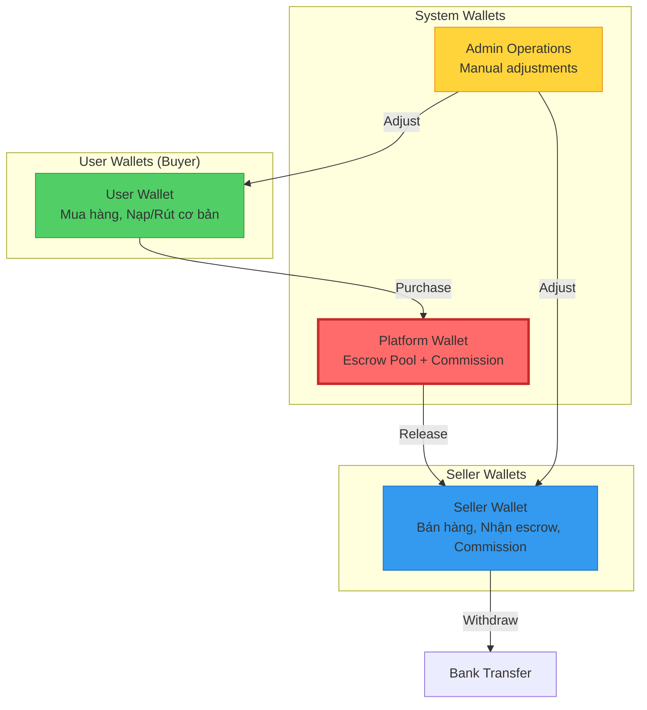
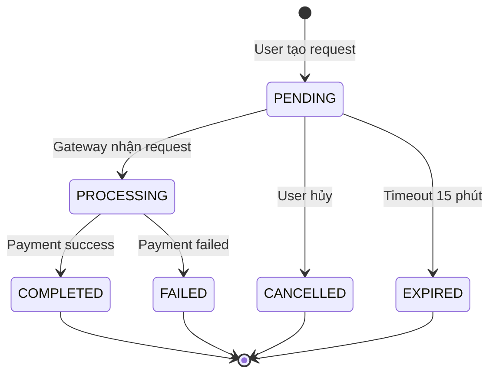
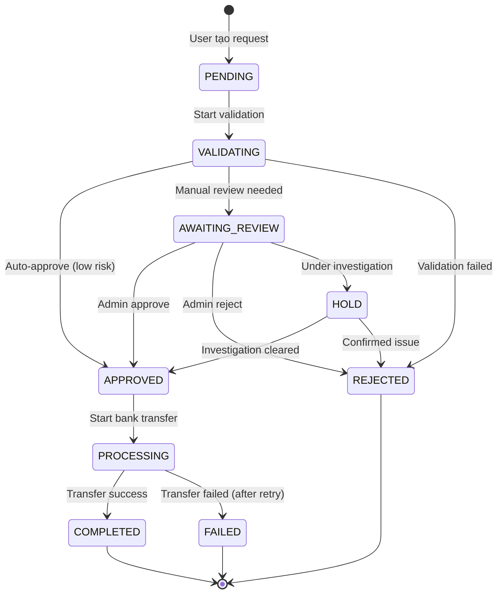

# TaphoaMMO Trust Wallet V3 - Comprehensive Design

**Document Version:** 1.0  
**Created:** 2026-01-01  
**Status:** Design Specification  
**Language:** Vietnamese (Technical Documentation)

---

## Mục lục

1. [Tổng quan cải tiến](#1-tổng-quan-cải-tiến)
2. [Data Models](#2-data-models)
3. [User Wallet Flows (Buyer)](#3-user-wallet-flows-buyer)
4. [Seller Wallet Flows](#4-seller-wallet-flows)
5. [Admin Wallet Flows](#5-admin-wallet-flows)
6. [Validation Engine - Dòng tiền](#6-validation-engine---dòng-tiền)
7. [Performance Optimization](#7-performance-optimization)
8. [Transaction Status Flow (Exness-style)](#8-transaction-status-flow-exness-style)
9. [Reconciliation Formulas](#9-reconciliation-formulas)

---

## 1. Tổng quan cải tiến

### 1.1 Trust Currency

```
┌─────────────────────────────────────────────────────────────┐
│                    TRUST CURRENCY                            │
├─────────────────────────────────────────────────────────────┤
│   1000 VND = 1 Trust (Cố định)                              │
│                                                              │
│   • Nạp tiền: VND → Trust (via 3rd party service)           │
│   • Rút tiền: Trust → VND (qua bank transfer)               │
│   • Giao dịch nội bộ: Trust only                            │
│   • Chỉ dùng số nguyên (i64), không float                   │
└─────────────────────────────────────────────────────────────┘
```

### 1.2 Kiến trúc 3 loại Wallet



### 1.3 Nguyên tắc Validation Dòng Tiền

**Công thức bất biến (Invariant):**

```
Cho mọi User/Seller tại thời điểm T:

TOTAL_DEPOSITED - TOTAL_WITHDRAWN = CURRENT_BALANCE + ESCROW_LOCKED + SPENT

Trong đó:
• TOTAL_DEPOSITED  = Σ(all deposits - cả auto + manual)
• TOTAL_WITHDRAWN  = Σ(all completed withdrawals)
• CURRENT_BALANCE  = available_trust + withdrawal_locked + dispute_locked
• ESCROW_LOCKED    = Tiền đang bị hold cho orders chưa complete
• SPENT            = Tiền đã chi (mua hàng - refund received)
```

### 1.4 Commission Setup theo Shop

```
┌─────────────────────────────────────────┐
│        COMMISSION BY SHOP               │
├─────────────────────────────────────────┤
│  Default: 5%                            │
│  Per-shop override: 1% - 20%            │
│                                         │
│  shop_commission_config {               │
│    shop_id: ObjectId                    │
│    rate: f64 (0.01 - 0.20)             │
│    effective_from: DateTime            │
│    effective_to: DateTime (nullable)   │
│    created_by: admin_id                │
│    reason: String                       │
│  }                                      │
└─────────────────────────────────────────┘
```

---

## 2. Data Models

### 2.1 Wallet Model (Enhanced)

```rust
// Wallet - Unified for all user types
struct Wallet {
    _id: ObjectId,
    wallet_id: String,           // "WLT-{ULID}"
    user_id: String,             // User ID or "PLATFORM"
    wallet_type: WalletType,     // USER, SELLER, PLATFORM
    
    // === Balance States ===
    available_trust: i64,        // Có thể dùng ngay
    withdrawal_locked: i64,      // Đang chờ rút
    dispute_locked: i64,         // Đang tranh chấp
    
    // === Computed (stored for fast access) ===
    total_trust: i64,            // = available + withdrawal_locked + dispute_locked
    
    // === Running Totals (for validation) ===
    lifetime_deposited: i64,     // Tổng đã nạp từ trước đến nay
    lifetime_withdrawn: i64,     // Tổng đã rút từ trước đến nay
    lifetime_spent: i64,         // Tổng đã chi (mua hàng)
    lifetime_received: i64,      // Tổng đã nhận (bán hàng, refund)
    
    // === Seller-specific ===
    commission_rate: Option<f64>,     // Override rate (default from config)
    commission_debt: i64,             // Tích lũy commission chưa trả
    
    // === Monthly Snapshot Reference ===
    last_snapshot_month: String,      // "2026-01" 
    last_snapshot_balance: i64,       // Balance tại cuối tháng đó
    last_snapshot_verified: bool,     // Đã verify chưa
    
    // === Status & Metadata ===
    status: WalletStatus,        // ACTIVE, SUSPENDED, FROZEN
    freeze_reason: Option<String>,
    created_at: DateTime,
    updated_at: DateTime,
}

enum WalletType {
    USER,      // Buyer
    SELLER,    // Vendor
    PLATFORM,  // System wallet
}

enum WalletStatus {
    ACTIVE,
    SUSPENDED,  // Temporary, can be unlocked
    FROZEN,     // Requires admin intervention
}
```

### 2.2 Transaction Model (Exness-style)

```rust
// Transaction - Immutable ledger entry
struct Transaction {
    _id: ObjectId,
    tx_id: String,               // "TXN-{ULID}"
    wallet_id: String,           // Reference to wallet
    user_id: String,             // Owner of wallet
    
    // === Type & Direction ===
    tx_type: TransactionType,
    direction: Direction,        // CREDIT (+) or DEBIT (-)
    
    // === Amounts ===
    amount: i64,                 // Trust amount (always positive)
    vnd_amount: Option<i64>,     // VND equivalent if applicable
    fee_amount: i64,             // Fee/commission deducted
    
    // === Balance Tracking ===
    balance_before: i64,         // Wallet balance before this tx
    balance_after: i64,          // Wallet balance after this tx
    balance_type: BalanceType,   // Which balance field affected
    
    // === Running Totals After Tx ===
    running_deposited: i64,      // lifetime_deposited after this tx
    running_withdrawn: i64,      // lifetime_withdrawn after this tx
    
    // === Status (Exness-style) ===
    status: TransactionStatus,
    status_history: Vec<StatusChange>,
    
    // === References ===
    reference_type: Option<ReferenceType>,
    reference_id: Option<String>,     // order_id, withdrawal_id, etc.
    external_ref: Option<String>,     // Bank ref, payment gateway ref
    
    // === Admin/System ===
    initiated_by: String,             // user_id or "SYSTEM" or admin_id
    admin_note: Option<String>,
    
    // === Timestamps ===
    created_at: DateTime,
    updated_at: DateTime,
    completed_at: Option<DateTime>,
}

enum TransactionType {
    // === Deposit ===
    DEPOSIT_PENDING,         // Waiting for payment
    DEPOSIT_VND_RECEIVED,    // VND received from gateway
    DEPOSIT_TRUST_CREDITED,  // Trust added to wallet
    DEPOSIT_MANUAL,          // Admin manual deposit
    
    // === Withdrawal ===
    WITHDRAWAL_REQUEST,      // User requested withdrawal
    WITHDRAWAL_VALIDATING,   // Running validation
    WITHDRAWAL_APPROVED,     // Approved, pending transfer
    WITHDRAWAL_PROCESSING,   // Bank transfer in progress
    WITHDRAWAL_COMPLETED,    // Completed successfully
    WITHDRAWAL_REJECTED,     // Failed validation
    WITHDRAWAL_CANCELLED,    // User cancelled
    
    // === Purchase/Order ===
    PURCHASE_DEBIT,          // Buyer pays
    ESCROW_HOLD,             // Platform receives
    ESCROW_RELEASE,          // Platform pays seller
    
    // === Refund ===
    REFUND_ESCROW,           // Refund from escrow
    REFUND_SELLER,           // Seller refunds (rare)
    
    // === Commission ===
    COMMISSION_ACCRUE,       // Commission debt recorded
    COMMISSION_DEDUCT,       // Commission paid on withdrawal
    COMMISSION_COLLECTED,    // Platform receives commission
    
    // === Admin Operations ===
    ADMIN_CREDIT,            // Admin adds trust
    ADMIN_DEBIT,             // Admin removes trust
    ADMIN_ADJUSTMENT,        // Balance correction
    ADMIN_FREEZE,            // Freeze funds
    ADMIN_UNFREEZE,          // Unfreeze funds
}

enum TransactionStatus {
    PENDING,         // Khởi tạo
    PROCESSING,      // Đang xử lý
    VALIDATING,      // Đang validate (withdrawal)
    AWAITING_REVIEW, // Chờ admin review
    APPROVED,        // Đã duyệt
    REJECTED,        // Bị từ chối
    COMPLETED,       // Hoàn thành
    FAILED,          // Thất bại
    CANCELLED,       // Đã hủy
    REVERSED,        // Đã hoàn (rollback)
}

struct StatusChange {
    from_status: TransactionStatus,
    to_status: TransactionStatus,
    changed_at: DateTime,
    changed_by: String,        // user_id, admin_id, or "SYSTEM"
    reason: Option<String>,
}

enum BalanceType {
    AVAILABLE,
    WITHDRAWAL_LOCKED,
    DISPUTE_LOCKED,
}
```

### 2.3 Monthly Snapshot Model

```rust
// MonthlySnapshot - Verified checkpoint for fast validation
struct MonthlySnapshot {
    _id: ObjectId,
    snapshot_id: String,         // "SNAP-{wallet_id}-{YYYY-MM}"
    wallet_id: String,
    user_id: String,
    month: String,               // "2026-01"
    
    // === Balances at End of Month ===
    closing_balance: i64,        // Calculated from transactions
    actual_balance: i64,         // From wallet at snapshot time
    
    // === Running Totals at End of Month ===
    total_deposited: i64,
    total_withdrawn: i64,
    total_spent: i64,
    total_received: i64,
    
    // === Verification ===
    discrepancy: i64,            // closing - actual
    status: SnapshotStatus,
    verified_at: Option<DateTime>,
    verified_by: Option<String>,
    
    // === Transaction Summary ===
    tx_count: i64,               // Number of transactions in month
    first_tx_id: Option<String>, // First tx of month
    last_tx_id: Option<String>,  // Last tx of month
    
    created_at: DateTime,
}

enum SnapshotStatus {
    PENDING,          // Not yet verified
    VERIFIED,         // Matches perfectly
    DISCREPANCY,      // Has discrepancy but acceptable
    CRITICAL,         // Major discrepancy, needs investigation
    MANUAL_OVERRIDE,  // Admin manually approved despite discrepancy
}
```

### 2.4 Withdrawal Request Model

```rust
struct WithdrawalRequest {
    _id: ObjectId,
    request_id: String,          // "WD-{ULID}"
    wallet_id: String,
    user_id: String,
    
    // === Amounts ===
    trust_amount: i64,           // Trust to withdraw
    commission_deduct: i64,      // Commission to pay
    net_trust: i64,              // trust_amount - commission_deduct
    vnd_amount: i64,             // net_trust * 1000
    
    // === Bank Info ===
    bank_code: String,
    bank_name: String,
    account_number: String,
    account_name: String,
    
    // === Status (Exness-style) ===
    status: WithdrawalStatus,
    status_history: Vec<StatusChange>,
    
    // === Validation Results ===
    validation_result: Option<ValidationResult>,
    validation_errors: Vec<ValidationError>,
    
    // === Processing ===
    approved_by: Option<String>,
    approved_at: Option<DateTime>,
    bank_transfer_ref: Option<String>,
    bank_transfer_at: Option<DateTime>,
    
    // === Timestamps ===
    created_at: DateTime,
    updated_at: DateTime,
    completed_at: Option<DateTime>,
    expires_at: DateTime,        // Auto-cancel if not processed
}

enum WithdrawalStatus {
    PENDING,              // Just created
    VALIDATING,           // Running validation
    VALIDATION_FAILED,    // Failed validation
    AWAITING_APPROVAL,    // Needs admin approval
    APPROVED,             // Approved, ready to process
    PROCESSING,           // Bank transfer in progress
    COMPLETED,            // Success
    REJECTED,             // Admin rejected
    CANCELLED,            // User cancelled
    EXPIRED,              // Auto-cancelled after timeout
    HOLD,                 // Funds on hold pending investigation
}

struct ValidationResult {
    balance_check: CheckResult,
    flow_check: CheckResult,
    fraud_check: CheckResult,
    limit_check: CheckResult,
    overall_passed: bool,
    risk_score: f64,
}

struct CheckResult {
    passed: bool,
    details: String,
    severity: Severity,
}

enum Severity {
    INFO,
    WARNING,
    ERROR,
    CRITICAL,
}
```

### 2.5 Admin Operation Log

```rust
struct AdminOperationLog {
    _id: ObjectId,
    log_id: String,              // "ALOG-{ULID}"
    
    // === Admin Info ===
    admin_id: String,
    admin_email: String,
    admin_role: String,
    
    // === Operation ===
    operation: AdminOperation,
    target_type: TargetType,
    target_id: String,           // wallet_id, user_id, shop_id
    
    // === Before/After ===
    before_state: serde_json::Value,
    after_state: serde_json::Value,
    
    // === Details ===
    amount: Option<i64>,
    reason: String,
    note: Option<String>,
    
    // === Related ===
    transaction_id: Option<String>,
    
    // === Metadata ===
    ip_address: String,
    user_agent: String,
    created_at: DateTime,
}

enum AdminOperation {
    MANUAL_DEPOSIT,
    MANUAL_DEBIT,
    BALANCE_ADJUSTMENT,
    COMMISSION_OVERRIDE,
    WALLET_FREEZE,
    WALLET_UNFREEZE,
    WITHDRAWAL_APPROVE,
    WITHDRAWAL_REJECT,
    FORCE_RELEASE_ESCROW,
    DISPUTE_RESOLVE,
}

enum TargetType {
    WALLET,
    USER,
    SHOP,
    WITHDRAWAL,
    ORDER,
}
```

---

## 3. User Wallet Flows (Buyer)

### 3.1 Deposit Flow (via 3rd Party Service)

```mermaid
flowchart TD
    Start([User nhấn "Nạp tiền"])
    
    %% Input Phase
    Start --> ShowForm[Hiển thị form<br/>Số tiền VND cần nạp]
    ShowForm --> UserInput[User nhập số tiền<br/>VD: 100,000 VND]
    
    %% Validation
    UserInput --> Validate{Validate}
    Validate -->|FAIL| Error[❌ Lỗi:<br/>- Min 10,000 VND<br/>- Max 50,000,000 VND<br/>- Chia hết cho 1,000]
    Validate -->|PASS| CalcTrust[Tính Trust<br/>100,000 ÷ 1,000 = 100 Trust]
    
    %% Create Pending Transaction
    CalcTrust --> CreateTx[Tạo Transaction #1<br/>Type: DEPOSIT_PENDING<br/>Status: PENDING<br/>amount: 100 Trust<br/>vnd: 100,000]
    
    %% Call 3rd Party
    CreateTx --> Call3rdParty[Gọi 3rd Party API<br/>VNPay/MoMo/etc]
    Call3rdParty --> GetPaymentURL[Nhận payment_url<br/>expires: 15 phút]
    GetPaymentURL --> Redirect[Redirect user<br/>đến payment gateway]
    
    %% User Pays
    Redirect --> UserPays[User thanh toán<br/>trên gateway]
    UserPays --> GatewayResult{Kết quả?}
    
    %% Success Path
    GatewayResult -->|SUCCESS| Webhook[Gateway gửi webhook]
    Webhook --> ValidateWebhook{Validate webhook<br/>signature?}
    ValidateWebhook -->|INVALID| RejectWebhook[❌ Reject<br/>Log suspicious]
    ValidateWebhook -->|VALID| ProcessWebhook[Xử lý webhook]
    
    %% Process Success
    ProcessWebhook --> BeginTx[🔵 BEGIN DB Transaction]
    BeginTx --> UpdateTx1[Update Transaction #1<br/>Status: COMPLETED<br/>external_ref: gateway_ref]
    
    UpdateTx1 --> CreateTx2[Tạo Transaction #2<br/>Type: DEPOSIT_TRUST_CREDITED<br/>Status: COMPLETED<br/>direction: CREDIT<br/>balance_before: old<br/>balance_after: old + 100]
    
    CreateTx2 --> UpdateWallet[Update Wallet<br/>available_trust += 100<br/>total_trust += 100<br/>lifetime_deposited += 100]
    
    UpdateWallet --> ValidateInvariant{Validate Invariant?}
    ValidateInvariant -->|FAIL| Rollback[🔴 ROLLBACK<br/>Alert admin]
    ValidateInvariant -->|PASS| Commit[🟢 COMMIT]
    
    Commit --> Notify[Notify user<br/>"Nạp thành công 100 Trust"]
    Notify --> End([Done])
    
    %% Failure Paths
    GatewayResult -->|CANCEL| CancelTx[Update Transaction<br/>Status: CANCELLED]
    GatewayResult -->|TIMEOUT| ExpireTx[Update Transaction<br/>Status: EXPIRED]
    
    style Start fill:#51cf66,stroke:#2f9e44
    style End fill:#51cf66,stroke:#2f9e44
    style BeginTx fill:#339af0,stroke:#1971c2
    style Commit fill:#51cf66,stroke:#2f9e44
    style Rollback fill:#ff6b6b,stroke:#c92a2a
    style Error fill:#ff6b6b,stroke:#c92a2a
```

### 3.2 User Withdrawal Flow

```mermaid
flowchart TD
    Start([User nhấn "Rút tiền"])
    
    %% Show Info
    Start --> ShowBalance[Hiển thị:<br/>Available: 500 Trust<br/>Có thể rút: 500,000 VND]
    ShowBalance --> UserInput[User nhập:<br/>- Số Trust: 100<br/>- Bank info]
    
    %% Validation
    UserInput --> Validate{Validate cơ bản}
    Validate -->|FAIL| Error[❌ Lỗi]
    Validate -->|PASS| CreateRequest[Tạo WithdrawalRequest<br/>Status: PENDING]
    
    %% Lock Funds
    CreateRequest --> BeginTx1[🔵 BEGIN Transaction]
    BeginTx1 --> LockTx[Tạo Transaction<br/>Type: WITHDRAWAL_REQUEST<br/>Move: available → withdrawal_locked]
    LockTx --> UpdateWallet1[Update Wallet<br/>available -= 100<br/>withdrawal_locked += 100]
    UpdateWallet1 --> CommitTx1[🟢 COMMIT]
    
    %% Background Validation
    CommitTx1 --> EnqueueJob[Enqueue: validate_withdrawal]
    EnqueueJob --> Response[Response: "Đang xử lý"]
    
    %% Async Validation
    EnqueueJob -.->|Async| StartValidation([Background Job])
    StartValidation --> UpdateStatus1[Update Request<br/>Status: VALIDATING]
    UpdateStatus1 --> RunValidation[Chạy Validation Engine<br/>xem Section 6]
    
    RunValidation --> ValidationResult{Kết quả?}
    
    %% Validation Failed
    ValidationResult -->|FAILED| HandleFailed[Update Request<br/>Status: VALIDATION_FAILED]
    HandleFailed --> UnlockFunds1[Unlock funds<br/>withdrawal_locked → available]
    UnlockFunds1 --> NotifyFailed[Notify user<br/>"Từ chối: {reason}"]
    
    %% Validation Needs Review
    ValidationResult -->|REVIEW| HandleReview[Update Request<br/>Status: AWAITING_APPROVAL]
    HandleReview --> NotifyAdmin[Notify admin<br/>"Cần review withdrawal"]
    
    %% Validation Passed - Auto Approve
    ValidationResult -->|PASSED| HandleApproved[Update Request<br/>Status: APPROVED]
    HandleApproved --> ProcessWithdrawal[Xử lý rút tiền<br/>Bank transfer]
    
    %% Bank Transfer
    ProcessWithdrawal --> UpdateStatus2[Status: PROCESSING]
    UpdateStatus2 --> CallBank[Gọi Bank API<br/>Transfer VND]
    CallBank --> BankResult{Bank result?}
    
    BankResult -->|FAIL| RetryLogic[Retry 3 lần]
    RetryLogic -->|Still fail| HandleBankFail[Status: FAILED<br/>Unlock funds<br/>Notify user]
    
    BankResult -->|SUCCESS| CompleteWithdrawal[Status: COMPLETED]
    CompleteWithdrawal --> BeginTx2[🔵 BEGIN Transaction]
    BeginTx2 --> CompleteTx[Transaction<br/>Type: WITHDRAWAL_COMPLETED<br/>withdrawal_locked -= 100<br/>total -= 100]
    CompleteTx --> UpdateWallet2[Update Wallet<br/>lifetime_withdrawn += 100]
    UpdateWallet2 --> CommitTx2[🟢 COMMIT]
    CommitTx2 --> NotifySuccess[Notify user<br/>"Rút thành công"]
    
    style Start fill:#339af0,stroke:#1971c2
    style BeginTx1 fill:#339af0,stroke:#1971c2
    style BeginTx2 fill:#339af0,stroke:#1971c2
    style CommitTx1 fill:#51cf66,stroke:#2f9e44
    style CommitTx2 fill:#51cf66,stroke:#2f9e44
    style Error fill:#ff6b6b,stroke:#c92a2a
    style HandleFailed fill:#ff6b6b,stroke:#c92a2a
```

### 3.3 User Purchase Flow

```mermaid
flowchart TD
    Start([User nhấn "Mua hàng"])
    
    %% Validation
    Start --> CheckStock{Còn hàng?}
    CheckStock -->|No| ErrorStock[❌ Hết hàng]
    CheckStock -->|Yes| CheckBalance{Đủ tiền?<br/>available >= price}
    CheckBalance -->|No| ErrorBalance[❌ Không đủ tiền]
    CheckBalance -->|Yes| BeginTx[🔵 BEGIN Transaction]
    
    %% Deduct Buyer
    BeginTx --> DeductTx[Transaction Buyer<br/>Type: PURCHASE_DEBIT<br/>direction: DEBIT<br/>amount: -price]
    DeductTx --> UpdateBuyerWallet[Update Buyer Wallet<br/>available -= price<br/>total -= price<br/>lifetime_spent += price]
    
    %% Credit Platform
    UpdateBuyerWallet --> CreditPlatform[Transaction Platform<br/>Type: ESCROW_HOLD<br/>direction: CREDIT<br/>amount: +price]
    CreditPlatform --> UpdatePlatformWallet[Update Platform Wallet<br/>available += price]
    
    %% Create Escrow
    UpdatePlatformWallet --> CreateEscrow[Tạo EscrowHold<br/>release_at: now + 3 days]
    CreateEscrow --> CreateOrder[Tạo/Update Order<br/>payment_status: PAID]
    
    %% Validate
    CreateOrder --> ValidateInvariant{Validate Invariant?}
    ValidateInvariant -->|FAIL| Rollback[🔴 ROLLBACK]
    ValidateInvariant -->|PASS| Commit[🟢 COMMIT]
    
    Commit --> NotifyBuyer[Notify Buyer<br/>"Mua thành công"]
    NotifyBuyer --> NotifySeller[Notify Seller<br/>"Có đơn mới"]
    NotifySeller --> End([Done])
    
    style Start fill:#51cf66,stroke:#2f9e44
    style End fill:#51cf66,stroke:#2f9e44
    style BeginTx fill:#339af0,stroke:#1971c2
    style Commit fill:#51cf66,stroke:#2f9e44
    style Rollback fill:#ff6b6b,stroke:#c92a2a
```

---

## 4. Seller Wallet Flows

### 4.1 Escrow Release Flow (Seller receives)

```mermaid
flowchart TD
    Start([Cron: Check escrow release])
    
    %% Query
    Start --> Query[Query EscrowHolds<br/>WHERE status = HOLDING<br/>AND release_at <= NOW]
    Query --> HasEscrow{Có escrow?}
    HasEscrow -->|No| EndNoAction([No action])
    HasEscrow -->|Yes| Loop[Lặp từng escrow]
    
    %% Process Each
    Loop --> GetInfo[Lấy info:<br/>- escrow_amount<br/>- seller_id<br/>- order_id]
    GetInfo --> GetCommissionRate[Lấy commission rate<br/>shop_commission_config<br/>hoặc default 5%]
    GetCommissionRate --> CalcCommission[commission = amount × rate<br/>seller_receives = amount - commission]
    
    %% Validate Platform
    CalcCommission --> CheckPlatform{Platform có đủ<br/>available >= amount?}
    CheckPlatform -->|No| AlertCritical[🚨 CRITICAL<br/>Platform thiếu tiền!]
    CheckPlatform -->|Yes| BeginTx[🔵 BEGIN Transaction]
    
    %% Deduct Platform
    BeginTx --> DeductPlatform[Transaction Platform<br/>Type: ESCROW_RELEASE<br/>direction: DEBIT<br/>amount: -escrow_amount]
    DeductPlatform --> UpdatePlatformBalance[Platform Wallet<br/>available -= amount]
    
    %% Credit Seller
    UpdatePlatformBalance --> CreditSeller[Transaction Seller<br/>Type: ESCROW_RELEASE<br/>direction: CREDIT<br/>amount: +seller_receives]
    CreditSeller --> UpdateSellerBalance[Seller Wallet<br/>available += seller_receives<br/>lifetime_received += seller_receives]
    
    %% Commission
    UpdateSellerBalance --> CommissionTx[Transaction Seller<br/>Type: COMMISSION_ACCRUE<br/>amount: commission]
    CommissionTx --> UpdateCommissionDebt[Seller Wallet<br/>commission_debt += commission]
    
    %% Platform Commission Record
    UpdateCommissionDebt --> PlatformCommissionTx[Transaction Platform<br/>Type: COMMISSION_COLLECTED<br/>amount: +commission]
    PlatformCommissionTx --> UpdatePlatformCommission[Platform Wallet<br/>total_commission_collected += commission]
    
    %% Finalize
    UpdatePlatformCommission --> UpdateEscrow[Update EscrowHold<br/>status: RELEASED]
    UpdateEscrow --> ValidateInvariant{Validate?}
    ValidateInvariant -->|FAIL| Rollback[🔴 ROLLBACK]
    ValidateInvariant -->|PASS| Commit[🟢 COMMIT]
    
    Commit --> NotifySeller[Notify Seller<br/>"Nhận {seller_receives} Trust"]
    NotifySeller --> HasMore{Còn escrow?}
    HasMore -->|Yes| Loop
    HasMore -->|No| End([Done])
    
    style Start fill:#339af0,stroke:#1971c2
    style End fill:#51cf66,stroke:#2f9e44
    style AlertCritical fill:#ff6b6b,stroke:#c92a2a,stroke-width:3px
    style BeginTx fill:#339af0,stroke:#1971c2
    style Commit fill:#51cf66,stroke:#2f9e44
```

### 4.2 Seller Withdrawal Flow

```mermaid
flowchart TD
    Start([Seller nhấn "Rút tiền"])
    
    %% Show Info
    Start --> ShowBalance[Hiển thị:<br/>Available: 1000 Trust<br/>Commission debt: 50 Trust<br/>Ước tính nhận: 950,000 VND]
    ShowBalance --> UserInput[Seller nhập:<br/>- Số Trust: 500<br/>- Bank info]
    
    %% Calculate
    UserInput --> CalcCommission[Tính commission:<br/>rate = get_shop_rate(shop_id)<br/>commission = min(500 × rate, debt)<br/>VD: min(25, 50) = 25 Trust]
    CalcCommission --> CalcNet[net = 500 - 25 = 475 Trust<br/>vnd = 475 × 1000 = 475,000 VND]
    
    %% Confirm
    CalcNet --> ShowConfirm[Xác nhận:<br/>Rút: 500 Trust<br/>Commission: 25 Trust<br/>Nhận: 475,000 VND]
    ShowConfirm --> Confirm{Xác nhận?}
    Confirm -->|No| Cancel([Hủy])
    Confirm -->|Yes| CreateRequest[Tạo WithdrawalRequest]
    
    %% Lock Funds
    CreateRequest --> BeginTx1[🔵 BEGIN]
    BeginTx1 --> LockTx[Lock 500 Trust<br/>available → withdrawal_locked]
    LockTx --> CommitTx1[🟢 COMMIT]
    
    %% Validation (Async)
    CommitTx1 --> EnqueueValidation[Enqueue: validate_withdrawal]
    EnqueueValidation -.->|Async| RunValidation[Chạy Validation Engine]
    
    RunValidation --> ValidationResult{Result?}
    ValidationResult -->|FAIL| RejectWithdrawal[Reject + Unlock]
    ValidationResult -->|REVIEW| WaitApproval[Wait Admin Approval]
    ValidationResult -->|PASS| ProcessWithdrawal[Process Withdrawal]
    
    %% Process
    ProcessWithdrawal --> CallBank[Bank Transfer<br/>475,000 VND]
    CallBank --> BankResult{Success?}
    BankResult -->|FAIL| HandleFail[Retry/Fail]
    BankResult -->|SUCCESS| CompleteFlow[Complete Flow]
    
    %% Complete
    CompleteFlow --> BeginTx2[🔵 BEGIN]
    BeginTx2 --> CompleteTx[Transaction<br/>Type: WITHDRAWAL_COMPLETED<br/>withdrawal_locked -= 500<br/>total -= 500]
    CompleteTx --> UpdateLifetime[Update Wallet<br/>lifetime_withdrawn += 500<br/>commission_debt -= 25]
    
    %% Commission to Platform
    UpdateLifetime --> CommissionToPlatform[Transaction Platform<br/>Type: COMMISSION_COLLECTED<br/>amount: +25 Trust]
    CommissionToPlatform --> UpdatePlatform[Platform Wallet<br/>available += 25<br/>total += 25]
    
    UpdatePlatform --> ValidateInvariant{Validate?}
    ValidateInvariant -->|FAIL| Rollback[🔴 ROLLBACK]
    ValidateInvariant -->|PASS| CommitTx2[🟢 COMMIT]
    
    CommitTx2 --> NotifySeller[Notify Seller<br/>"Rút thành công"]
    NotifySeller --> End([Done])
    
    style Start fill:#339af0,stroke:#1971c2
    style End fill:#51cf66,stroke:#2f9e44
    style BeginTx1 fill:#339af0,stroke:#1971c2
    style BeginTx2 fill:#339af0,stroke:#1971c2
    style CommitTx1 fill:#51cf66,stroke:#2f9e44
    style CommitTx2 fill:#51cf66,stroke:#2f9e44
```

---

## 5. Admin Wallet Flows

### 5.1 Admin Dashboard Overview

```
┌─────────────────────────────────────────────────────────────────┐
│                    ADMIN WALLET DASHBOARD                        │
├─────────────────────────────────────────────────────────────────┤
│                                                                  │
│  ┌─────────────────┐  ┌─────────────────┐  ┌─────────────────┐  │
│  │ TỔNG TRUST      │  │ ĐANG HOLD       │  │ COMMISSION      │  │
│  │ TRONG HỆ THỐNG  │  │ (ESCROW)        │  │ ĐÃ THU          │  │
│  │                 │  │                 │  │                 │  │
│  │ 50,000,000     │  │ 5,000,000      │  │ 2,500,000      │  │
│  │ Trust          │  │ Trust          │  │ Trust          │  │
│  └─────────────────┘  └─────────────────┘  └─────────────────┘  │
│                                                                  │
│  ┌───────────────────────────────────────────────────────────┐  │
│  │ HOLD BY SHOP                                               │  │
│  ├───────────────────────────────────────────────────────────┤  │
│  │ Shop               | Hold Amount | Status    | Action     │  │
│  │ -------------------|-------------|-----------|----------- │  │
│  │ Shop A             | 2,000,000   | NORMAL    | [View]     │  │
│  │ Shop B             | 1,500,000   | NORMAL    | [View]     │  │
│  │ Shop C (⚠️)        | 1,000,000   | DISPUTE   | [Review]   │  │
│  │ Shop D             | 500,000     | NORMAL    | [View]     │  │
│  └───────────────────────────────────────────────────────────┘  │
│                                                                  │
│  ┌───────────────────────────────────────────────────────────┐  │
│  │ PENDING WITHDRAWALS (Chờ duyệt)                           │  │
│  ├───────────────────────────────────────────────────────────┤  │
│  │ User     | Amount    | Risk Score | Status         | Act  │  │
│  │ ---------|-----------|------------|----------------|----- │  │
│  │ seller_1 | 10,000 T  | 0.45       | AWAITING_REVIEW| [✓][✗]│
│  │ user_2   | 50,000 T  | 0.65       | AWAITING_REVIEW| [✓][✗]│
│  └───────────────────────────────────────────────────────────┘  │
│                                                                  │
└─────────────────────────────────────────────────────────────────┘
```

### 5.2 Admin Manual Deposit Flow

```mermaid
flowchart TD
    Start([Admin chọn "Nạp tiền thủ công"])
    
    %% Selection
    Start --> SelectUser[Chọn User/Seller]
    SelectUser --> ShowForm[Form nhập:<br/>- Số Trust<br/>- Lý do (bắt buộc)<br/>- Ghi chú]
    
    %% Validation
    ShowForm --> Validate{Validate}
    Validate -->|FAIL| Error[❌ Lỗi:<br/>- Trust > 0<br/>- Trust <= 1,000,000<br/>- Lý do >= 10 ký tự]
    Validate -->|PASS| CheckPerm{Admin có quyền<br/>WALLET_DEPOSIT?}
    CheckPerm -->|No| PermError[❌ Không có quyền]
    CheckPerm -->|Yes| Confirm{Xác nhận?}
    
    Confirm -->|No| Cancel([Hủy])
    Confirm -->|Yes| BeginTx[🔵 BEGIN Transaction]
    
    %% Create Transaction
    BeginTx --> CreateTx[Tạo Transaction<br/>Type: ADMIN_CREDIT<br/>Status: COMPLETED<br/>direction: CREDIT<br/>initiated_by: admin_id<br/>admin_note: reason]
    
    CreateTx --> UpdateWallet[Update Target Wallet<br/>available += amount<br/>total += amount<br/>lifetime_deposited += amount]
    
    %% Create Audit Log
    UpdateWallet --> CreateAuditLog[Tạo AdminOperationLog<br/>operation: MANUAL_DEPOSIT<br/>admin_id, target_id<br/>amount, reason<br/>before_state, after_state]
    
    %% Validate
    CreateAuditLog --> ValidateInvariant{Validate Invariant?}
    ValidateInvariant -->|FAIL| Rollback[🔴 ROLLBACK<br/>Alert supervisor]
    ValidateInvariant -->|PASS| Commit[🟢 COMMIT]
    
    %% Notifications
    Commit --> NotifyUser[Email User<br/>"Admin đã nạp X Trust"]
    NotifyUser --> NotifySupervisor[Notify Supervisor<br/>nếu amount > threshold]
    NotifySupervisor --> End([Done])
    
    style Start fill:#ffd43b,stroke:#f08c00
    style End fill:#51cf66,stroke:#2f9e44
    style BeginTx fill:#339af0,stroke:#1971c2
    style Commit fill:#51cf66,stroke:#2f9e44
    style Error fill:#ff6b6b,stroke:#c92a2a
```

### 5.3 Admin Manual Debit Flow

```mermaid
flowchart TD
    Start([Admin chọn "Trừ tiền"])
    
    %% Selection
    Start --> SelectUser[Chọn User/Seller]
    SelectUser --> ShowWallet[Hiển thị Wallet info:<br/>Available: X Trust<br/>Locked: Y Trust]
    ShowWallet --> ShowForm[Form nhập:<br/>- Số Trust cần trừ<br/>- Lý do (bắt buộc)<br/>- Reference (order_id, etc)]
    
    %% Validation
    ShowForm --> Validate{Validate}
    Validate -->|FAIL| Error[❌ Lỗi]
    Validate -->|PASS| CheckBalance{available >= amount?}
    CheckBalance -->|No| BalanceError[❌ Số dư không đủ<br/>Chỉ có thể trừ: X Trust]
    CheckBalance -->|Yes| CheckPerm{Admin có quyền<br/>WALLET_DEBIT?}
    CheckPerm -->|No| PermError[❌ Không có quyền]
    
    %% Supervisor Approval Required
    CheckPerm -->|Yes| CheckAmount{amount > 10,000 Trust?}
    CheckAmount -->|Yes| RequireSupervisor[Yêu cầu Supervisor<br/>approve qua 2FA]
    RequireSupervisor --> SupervisorApprove{Supervisor approve?}
    SupervisorApprove -->|No| Reject([Bị từ chối])
    SupervisorApprove -->|Yes| Confirm
    CheckAmount -->|No| Confirm{Admin xác nhận?}
    
    Confirm -->|No| Cancel([Hủy])
    Confirm -->|Yes| BeginTx[🔵 BEGIN Transaction]
    
    %% Create Transaction
    BeginTx --> CreateTx[Tạo Transaction<br/>Type: ADMIN_DEBIT<br/>Status: COMPLETED<br/>direction: DEBIT<br/>initiated_by: admin_id<br/>admin_note: reason]
    
    CreateTx --> UpdateWallet[Update Target Wallet<br/>available -= amount<br/>total -= amount]
    
    %% Audit Log
    UpdateWallet --> CreateAuditLog[Tạo AdminOperationLog<br/>operation: MANUAL_DEBIT<br/>full audit trail]
    
    CreateAuditLog --> ValidateInvariant{Validate?}
    ValidateInvariant -->|FAIL| Rollback[🔴 ROLLBACK]
    ValidateInvariant -->|PASS| Commit[🟢 COMMIT]
    
    Commit --> NotifyUser[Notify User<br/>"Tài khoản bị trừ X Trust"]
    NotifyUser --> End([Done])
    
    style Start fill:#ffd43b,stroke:#f08c00
    style End fill:#51cf66,stroke:#2f9e44
    style RequireSupervisor fill:#ff6b6b,stroke:#c92a2a
```

### 5.4 Admin Commission Setup per Shop

```mermaid
flowchart TD
    Start([Admin chọn "Cài đặt Commission"])
    
    %% List Shops
    Start --> ListShops[Hiển thị danh sách Shop<br/>với commission rate hiện tại]
    ListShops --> SelectShop[Admin chọn Shop]
    
    %% Show Form
    SelectShop --> ShowForm[Form:<br/>- Current rate: 5%<br/>- New rate: ____%<br/>- Effective from: ____<br/>- Effective to: ____ (optional)<br/>- Reason]
    
    %% Validation
    ShowForm --> Validate{Validate}
    Validate -->|FAIL| Error[❌ Lỗi:<br/>- Rate: 1% - 20%<br/>- Effective from >= today]
    Validate -->|PASS| ShowImpact[Hiển thị Impact:<br/>"Shop có 100 orders/tháng<br/>Thay đổi commission từ 5% → 3%<br/>Giảm thu: ~200,000 Trust/tháng"]
    
    ShowImpact --> Confirm{Admin xác nhận?}
    Confirm -->|No| Cancel([Hủy])
    Confirm -->|Yes| CheckPerm{Admin có quyền<br/>COMMISSION_MANAGE?}
    CheckPerm -->|No| PermError[❌ Không có quyền]
    CheckPerm -->|Yes| BeginTx[🔵 BEGIN]
    
    %% Save Config
    BeginTx --> DeactivateOld[Deactivate config cũ<br/>effective_to = now]
    DeactivateOld --> CreateNewConfig[Tạo shop_commission_config<br/>shop_id, rate<br/>effective_from, created_by]
    
    %% Audit
    CreateNewConfig --> CreateAuditLog[Tạo AdminOperationLog<br/>operation: COMMISSION_OVERRIDE<br/>before_rate, after_rate]
    CreateAuditLog --> Commit[🟢 COMMIT]
    
    %% Notify
    Commit --> NotifyShop[Notify Shop Owner<br/>"Commission rate thay đổi"]
    NotifyShop --> End([Done])
    
    style Start fill:#ffd43b,stroke:#f08c00
    style End fill:#51cf66,stroke:#2f9e44
```

### 5.5 Admin Withdrawal Review Flow

```mermaid
flowchart TD
    Start([Admin xem Pending Withdrawals])
    
    %% List
    Start --> ListPending[Danh sách Withdrawals<br/>Status: AWAITING_APPROVAL<br/>Sắp xếp theo risk_score DESC]
    ListPending --> SelectOne[Admin chọn 1 withdrawal]
    
    %% Show Details
    SelectOne --> ShowDetails[Hiển thị chi tiết:<br/>- User info<br/>- Amount: 10,000 Trust<br/>- Risk Score: 0.65<br/>- Validation Results<br/>- Recent transaction history]
    
    ShowDetails --> ShowValidation[Hiển thị Validation Details:<br/>✅ Balance Check: PASS<br/>✅ Flow Check: PASS<br/>⚠️ Fraud Check: WARNING<br/>   - First withdrawal<br/>   - Large amount<br/>✅ Limit Check: PASS]
    
    %% Decision
    ShowValidation --> Decision{Admin quyết định?}
    
    %% Approve
    Decision -->|Approve| CheckPerm{Có quyền<br/>WITHDRAWAL_APPROVE?}
    CheckPerm -->|No| PermError[❌ Không có quyền]
    CheckPerm -->|Yes| ApproveConfirm{Xác nhận approve?}
    ApproveConfirm -->|Yes| UpdateApprove[Update Request<br/>Status: APPROVED<br/>approved_by: admin_id<br/>approved_at: now]
    UpdateApprove --> CreateApproveLog[Tạo AdminOperationLog<br/>operation: WITHDRAWAL_APPROVE]
    CreateApproveLog --> EnqueueProcess[Enqueue: process_withdrawal]
    EnqueueProcess --> NotifyUser1[Notify User<br/>"Yêu cầu rút tiền đã được duyệt"]
    
    %% Reject
    Decision -->|Reject| RejectForm[Form nhập lý do từ chối]
    RejectForm --> UpdateReject[Update Request<br/>Status: REJECTED<br/>reject_reason: reason]
    UpdateReject --> UnlockFunds[Unlock funds<br/>withdrawal_locked → available]
    UnlockFunds --> CreateRejectLog[Tạo AdminOperationLog<br/>operation: WITHDRAWAL_REJECT]
    CreateRejectLog --> NotifyUser2[Notify User<br/>"Yêu cầu bị từ chối: reason"]
    
    %% Hold for Investigation
    Decision -->|Hold| HoldForm[Form nhập lý do hold]
    HoldForm --> UpdateHold[Update Request<br/>Status: HOLD]
    UpdateHold --> CreateHoldLog[Tạo AdminOperationLog]
    CreateHoldLog --> NotifyUser3[Notify User<br/>"Yêu cầu đang được điều tra"]
    
    NotifyUser1 --> End([Done])
    NotifyUser2 --> End
    NotifyUser3 --> End
    
    style Start fill:#ffd43b,stroke:#f08c00
    style End fill:#51cf66,stroke:#2f9e44
    style UpdateApprove fill:#51cf66,stroke:#2f9e44
    style UpdateReject fill:#ff6b6b,stroke:#c92a2a
    style UpdateHold fill:#ffd43b,stroke:#f08c00
```

### 5.6 Admin View Shop Details

```
┌─────────────────────────────────────────────────────────────────┐
│                    SHOP DETAIL VIEW                              │
├─────────────────────────────────────────────────────────────────┤
│ Shop: "Gaming Accounts Store"          Owner: seller_123        │
│ Commission Rate: 3% (custom)           Status: ACTIVE           │
├─────────────────────────────────────────────────────────────────┤
│                                                                  │
│  ┌─────────────┐  ┌─────────────┐  ┌─────────────┐              │
│  │ TOTAL SALES │  │ HOLD AMOUNT │  │ COMMISSION  │              │
│  │ (All time)  │  │ (Current)   │  │ COLLECTED   │              │
│  │ 100,000 T   │  │ 15,000 T    │  │ 3,000 T     │              │
│  └─────────────┘  └─────────────┘  └─────────────┘              │
│                                                                  │
│  ┌───────────────────────────────────────────────────────────┐  │
│  │ ESCROW BREAKDOWN                                          │  │
│  ├───────────────────────────────────────────────────────────┤  │
│  │ Status       | Count | Amount    | Release Date           │  │
│  │ -------------|-------|-----------|----------------------- │  │
│  │ HOLDING      | 25    | 12,000 T  | Jan 2-5, 2026         │  │
│  │ DISPUTE      | 3     | 3,000 T   | On hold               │  │
│  │ RELEASED     | 150   | 85,000 T  | Completed             │  │
│  └───────────────────────────────────────────────────────────┘  │
│                                                                  │
│  ┌───────────────────────────────────────────────────────────┐  │
│  │ RECENT TRANSACTIONS                                       │  │
│  ├───────────────────────────────────────────────────────────┤  │
│  │ Date       | Type           | Amount  | Status           │  │
│  │ -----------|----------------|---------|------------------ │  │
│  │ Jan 1 10:30| ESCROW_RELEASE | +950 T  | COMPLETED        │  │
│  │ Jan 1 09:15| ESCROW_RELEASE | +475 T  | COMPLETED        │  │
│  │ Dec 31     | WITHDRAWAL     | -5000 T | COMPLETED        │  │
│  └───────────────────────────────────────────────────────────┘  │
│                                                                  │
│  [Actions: Freeze Shop | Change Commission | View All Txns]     │
│                                                                  │
└─────────────────────────────────────────────────────────────────┘
```

---

## 6. Validation Engine - Dòng tiền

### 6.1 Validation Architecture

```
┌─────────────────────────────────────────────────────────────────┐
│                    VALIDATION ENGINE                             │
├─────────────────────────────────────────────────────────────────┤
│                                                                  │
│  Input: withdrawal_request, wallet                              │
│                                                                  │
│  ┌─────────────┐    ┌─────────────┐    ┌─────────────┐         │
│  │   Check 1   │    │   Check 2   │    │   Check 3   │         │
│  │  Balance    │───→│   Flow      │───→│   Fraud     │         │
│  │  Integrity  │    │  Validation │    │   Pattern   │         │
│  └─────────────┘    └─────────────┘    └─────────────┘         │
│        │                  │                  │                  │
│        ↓                  ↓                  ↓                  │
│  ┌─────────────────────────────────────────────────────┐       │
│  │              Check 4: Daily Limit                    │       │
│  └─────────────────────────────────────────────────────┘       │
│                          │                                      │
│                          ↓                                      │
│  ┌─────────────────────────────────────────────────────┐       │
│  │              Aggregate Results                       │       │
│  │              Calculate Risk Score                    │       │
│  │              Determine: PASS / REVIEW / REJECT       │       │
│  └─────────────────────────────────────────────────────┘       │
│                                                                  │
└─────────────────────────────────────────────────────────────────┘
```

### 6.2 Check 1: Balance Integrity (Sử dụng Monthly Snapshot)

```mermaid
flowchart TD
    Start([Check Balance Integrity])
    
    %% Get Snapshot
    Start --> GetSnapshot[Lấy MonthlySnapshot<br/>của tháng trước]
    GetSnapshot --> HasSnapshot{Có snapshot?}
    
    HasSnapshot -->|No| FullCalc[Tính từ đầu<br/>Σ(all transactions)]
    HasSnapshot -->|Yes| IncrementalCalc[Tính incremental<br/>từ snapshot]
    
    %% Incremental Calculation (Performance Optimized)
    IncrementalCalc --> GetCurrentMonth[Query transactions<br/>từ đầu tháng này đến now<br/>WHERE created_at >= month_start]
    GetCurrentMonth --> CalcDelta[delta_credit = Σ(credits this month)<br/>delta_debit = Σ(debits this month)]
    CalcDelta --> CalcExpected[expected_balance = <br/>snapshot_balance + delta_credit - delta_debit]
    
    %% Compare
    CalcExpected --> Compare{expected == wallet.total_trust?}
    FullCalc --> Compare
    
    Compare -->|Yes| Pass[✅ PASS<br/>Balance integrity verified]
    Compare -->|No| CalcDiscrepancy[discrepancy = expected - actual]
    
    CalcDiscrepancy --> CheckSeverity{abs(discrepancy) > 100?}
    CheckSeverity -->|Yes| CriticalFail[❌ CRITICAL FAIL<br/>Major discrepancy detected<br/>Auto-reject withdrawal]
    CheckSeverity -->|No| WarningFail[⚠️ WARNING<br/>Minor discrepancy<br/>Flag for review]
    
    Pass --> ReturnResult[Return CheckResult<br/>passed: true]
    CriticalFail --> ReturnResult2[Return CheckResult<br/>passed: false<br/>severity: CRITICAL]
    WarningFail --> ReturnResult3[Return CheckResult<br/>passed: true<br/>severity: WARNING]
    
    style Start fill:#339af0,stroke:#1971c2
    style Pass fill:#51cf66,stroke:#2f9e44
    style CriticalFail fill:#ff6b6b,stroke:#c92a2a,stroke-width:3px
    style WarningFail fill:#ffd43b,stroke:#f08c00
```

**SQL Query (Optimized - chỉ query 1 tháng):**

```sql
-- Lấy delta từ đầu tháng
SELECT 
    SUM(CASE WHEN direction = 'CREDIT' THEN amount ELSE 0 END) as total_credits,
    SUM(CASE WHEN direction = 'DEBIT' THEN amount ELSE 0 END) as total_debits,
    COUNT(*) as tx_count
FROM transactions
WHERE wallet_id = :wallet_id
  AND created_at >= :month_start
  AND status = 'COMPLETED';

-- expected_balance = last_snapshot_balance + total_credits - total_debits
```

### 6.3 Check 2: Flow Validation (Dòng tiền logic)

```mermaid
flowchart TD
    Start([Check Flow Validation])
    
    %% Get Data
    Start --> GetWallet[Lấy Wallet với running totals]
    GetWallet --> GetRunningTotals[lifetime_deposited<br/>lifetime_withdrawn<br/>lifetime_spent<br/>lifetime_received]
    
    %% Calculate Expected Balance
    GetRunningTotals --> CalcExpected[expected_balance = <br/>deposited - withdrawn + received - spent]
    
    %% Get Active Escrow
    CalcExpected --> GetActiveEscrow[Lấy active escrows<br/>mà user là buyer]
    GetActiveEscrow --> CalcEscrowOut[escrow_out = Σ(escrows where buyer)]
    
    %% Adjusted Expected
    CalcEscrowOut --> AdjustExpected[adjusted_expected = <br/>expected_balance - escrow_out]
    
    %% Compare
    AdjustExpected --> Compare{adjusted_expected >= wallet.total_trust?}
    
    Compare -->|Yes| Pass[✅ PASS<br/>Flow validation OK]
    Compare -->|No| Fail[❌ FAIL<br/>Flow không khớp<br/>Có thể có giao dịch ẩn/hack]
    
    Pass --> Return1[Return CheckResult: passed]
    Fail --> Return2[Return CheckResult: failed<br/>reason: "Dòng tiền không khớp"]
    
    style Start fill:#339af0,stroke:#1971c2
    style Pass fill:#51cf66,stroke:#2f9e44
    style Fail fill:#ff6b6b,stroke:#c92a2a
```

**Công thức Flow Validation:**

```
Flow Invariant:
────────────────────────────────────────────────────
DEPOSITED - WITHDRAWN + RECEIVED - SPENT - ESCROW_OUT = BALANCE

Trong đó:
• DEPOSITED   = lifetime_deposited (tổng nạp)
• WITHDRAWN   = lifetime_withdrawn (tổng rút)
• RECEIVED    = lifetime_received (nhận từ bán hàng, refund)
• SPENT       = lifetime_spent (chi cho mua hàng)
• ESCROW_OUT  = Tiền đang bị hold ở Platform (là buyer)
• BALANCE     = total_trust trong wallet
────────────────────────────────────────────────────
```

### 6.4 Check 3: Fraud Pattern Detection

```mermaid
flowchart TD
    Start([Check Fraud Patterns])
    
    Start --> InitScore[risk_score = 0.0]
    
    %% Pattern 1: Too many withdrawals today
    InitScore --> Check1[Pattern 1: Rút nhiều trong ngày]
    Check1 --> Query1[today_withdrawals = count(*)<br/>WHERE type = WITHDRAWAL<br/>AND created_at >= today_start]
    Query1 --> Eval1{today_withdrawals >= 5?}
    Eval1 -->|Yes| Add1[risk_score += 0.3]
    Eval1 -->|No| Check2
    Add1 --> Check2
    
    %% Pattern 2: Large sudden withdrawal
    Check2 --> Check2a[Pattern 2: Rút đột ngột lớn]
    Check2a --> Query2[avg_balance_30d = AVG(daily balance)]
    Query2 --> Eval2{withdrawal > avg × 5?}
    Eval2 -->|Yes| Add2[risk_score += 0.4]
    Eval2 -->|No| Check3
    Add2 --> Check3
    
    %% Pattern 3: New account rapid withdrawal
    Check3 --> Check3a[Pattern 3: Account mới rút nhanh]
    Check3a --> GetAge[account_age = now - created_at]
    GetAge --> Eval3{age < 7 days AND<br/>withdrawal > 1000?}
    Eval3 -->|Yes| Add3[risk_score += 0.5]
    Eval3 -->|No| Check4
    Add3 --> Check4
    
    %% Pattern 4: First withdrawal
    Check4 --> Check4a[Pattern 4: Lần rút đầu tiên]
    Check4a --> Query4[prev_withdrawals = count(*)]
    Query4 --> Eval4{prev_withdrawals == 0?}
    Eval4 -->|Yes| Add4[risk_score += 0.2]
    Eval4 -->|No| Check5
    Add4 --> Check5
    
    %% Pattern 5: Unusual timing
    Check5 --> Check5a[Pattern 5: Thời gian bất thường]
    Check5a --> GetHour[hour = now.hour()]
    GetHour --> Eval5{hour >= 0 AND hour < 6?}
    Eval5 -->|Yes| Add5[risk_score += 0.1]
    Eval5 -->|No| Aggregate
    Add5 --> Aggregate
    
    %% Aggregate
    Aggregate --> Decision{risk_score?}
    Decision -->|< 0.3| Pass[✅ PASS - Auto approve]
    Decision -->|0.3 - 0.7| Review[⚠️ REVIEW - Manual check]
    Decision -->|>= 0.7| Reject[❌ REJECT - Auto reject]
    
    Pass --> Return1[Return: passed=true, risk=low]
    Review --> Return2[Return: passed=true, risk=medium]
    Reject --> Return3[Return: passed=false, risk=high]
    
    style Start fill:#339af0,stroke:#1971c2
    style Pass fill:#51cf66,stroke:#2f9e44
    style Review fill:#ffd43b,stroke:#f08c00
    style Reject fill:#ff6b6b,stroke:#c92a2a
```

### 6.5 Check 4: Daily/Monthly Limits

```
┌─────────────────────────────────────────────────────────────────┐
│                    WITHDRAWAL LIMITS                             │
├─────────────────────────────────────────────────────────────────┤
│                                                                  │
│  PER TRANSACTION:                                                │
│  • Min: 10 Trust (10,000 VND)                                   │
│  • Max: 100,000 Trust (100,000,000 VND)                         │
│                                                                  │
│  DAILY LIMIT:                                                    │
│  • Total: 500,000 Trust (500,000,000 VND)                       │
│  • If exceeded: Require manual review                           │
│                                                                  │
│  MONTHLY LIMIT:                                                  │
│  • Total: 5,000,000 Trust (5 billion VND)                       │
│  • If exceeded: Block + Admin notification                      │
│                                                                  │
│  VELOCITY LIMIT:                                                 │
│  • Max 5 withdrawals per day                                    │
│  • Max 20 withdrawals per month                                 │
│                                                                  │
└─────────────────────────────────────────────────────────────────┘
```

### 6.6 Rejection Flow

```mermaid
flowchart TD
    Start([Validation Failed])
    
    %% Determine Reason
    Start --> CheckReason{Reason?}
    
    %% Balance Integrity Failed
    CheckReason -->|Balance Mismatch| BalanceAction[Action:<br/>1. Auto-reject withdrawal<br/>2. FREEZE wallet<br/>3. Alert admin CRITICAL<br/>4. Create investigation ticket]
    
    %% Flow Validation Failed
    CheckReason -->|Flow Invalid| FlowAction[Action:<br/>1. Auto-reject withdrawal<br/>2. SUSPEND wallet<br/>3. Alert admin HIGH<br/>4. Request user verification]
    
    %% Fraud Score High
    CheckReason -->|High Fraud Risk| FraudAction[Action:<br/>1. Auto-reject withdrawal<br/>2. Flag account<br/>3. Alert security team<br/>4. Log for ML training]
    
    %% Limit Exceeded
    CheckReason -->|Limit Exceeded| LimitAction[Action:<br/>1. Reject withdrawal<br/>2. Inform user of limits<br/>3. Suggest smaller amount]
    
    %% Common Actions
    BalanceAction --> UnlockFunds[Unlock funds<br/>withdrawal_locked → available<br/>(nếu không freeze)]
    FlowAction --> UnlockFunds
    FraudAction --> UnlockFunds
    LimitAction --> UnlockFunds
    
    UnlockFunds --> UpdateRequest[Update WithdrawalRequest<br/>Status: REJECTED/VALIDATION_FAILED<br/>validation_errors: [...]<br/>reject_reason: detail]
    
    UpdateRequest --> CreateTx[Tạo Transaction<br/>Type: WITHDRAWAL_REJECTED<br/>Reverse lock transaction]
    
    CreateTx --> NotifyUser[Notify User<br/>"Yêu cầu rút tiền bị từ chối<br/>Lý do: {reason}"]
    
    NotifyUser --> End([Done])
    
    style Start fill:#ff6b6b,stroke:#c92a2a
    style BalanceAction fill:#ff6b6b,stroke:#c92a2a,stroke-width:3px
    style FlowAction fill:#ff6b6b,stroke:#c92a2a
    style FraudAction fill:#ffd43b,stroke:#f08c00
```

### 6.7 HOLD Flow (Pending Investigation)

```mermaid
flowchart TD
    Start([Admin chọn HOLD])
    
    %% Create Hold
    Start --> UpdateRequest[Update WithdrawalRequest<br/>Status: HOLD<br/>hold_reason: reason<br/>hold_at: now<br/>hold_by: admin_id]
    
    %% Keep Funds Locked
    UpdateRequest --> Note[Funds REMAIN in withdrawal_locked<br/>User cannot use or re-request]
    
    %% Create Investigation
    Note --> CreateTicket[Tạo Investigation Ticket<br/>type: WITHDRAWAL_HOLD<br/>priority: based on amount<br/>assigned_to: security_team]
    
    %% Notify
    CreateTicket --> NotifyUser[Notify User<br/>"Yêu cầu đang được xem xét<br/>Vui lòng chờ 1-3 ngày làm việc"]
    NotifyUser --> NotifyAdmin[Notify Security Team<br/>"New hold case: {request_id}"]
    
    %% Investigation Options
    NotifyAdmin --> InvestigationEnd([Investigation...])
    InvestigationEnd --> Decision{Kết quả điều tra?}
    
    Decision -->|Clear| Release[Release HOLD<br/>→ APPROVED<br/>→ Process withdrawal]
    Decision -->|Suspicious| Reject[REJECT<br/>→ Unlock funds<br/>→ Possible account action]
    Decision -->|Confirmed Fraud| Block[REJECT<br/>→ FREEZE account<br/>→ Report authorities]
    
    style Start fill:#ffd43b,stroke:#f08c00
    style Block fill:#ff6b6b,stroke:#c92a2a,stroke-width:3px
```

---

## 7. Performance Optimization

### 7.1 Monthly Snapshot Strategy

```
┌─────────────────────────────────────────────────────────────────┐
│                 MONTHLY SNAPSHOT STRATEGY                        │
├─────────────────────────────────────────────────────────────────┤
│                                                                  │
│  Problem: Querying all transactions for validation is slow      │
│           (có thể có millions of transactions)                  │
│                                                                  │
│  Solution: Monthly snapshot + Incremental calculation           │
│                                                                  │
│  ┌─────────┐  ┌─────────┐  ┌─────────┐  ┌─────────┐            │
│  │ Nov '25 │──│ Dec '25 │──│ Jan '26 │──│  Now    │            │
│  │Snapshot │  │Snapshot │  │Snapshot │  │ Query   │            │
│  │ 10,000  │  │ 15,000  │  │ 18,000  │  │ +2,000  │            │
│  └─────────┘  └─────────┘  └─────────┘  └─────────┘            │
│                                 ↑              ↑                │
│                            Verified       Only query            │
│                            checkpoint     this month            │
│                                                                  │
│  Validation Query:                                              │
│  expected = Jan_Snapshot + Σ(Feb_transactions)                  │
│            = 18,000 + 2,000 = 20,000                           │
│                                                                  │
│  Instead of: Σ(all transactions since account creation)         │
│                                                                  │
└─────────────────────────────────────────────────────────────────┘
```

### 7.2 Snapshot Creation (Cron Job)

```mermaid
flowchart TD
    Start([Cron: Ngày 1 mỗi tháng, 2:00 AM])
    
    Start --> GetMonth[target_month = tháng trước<br/>VD: 2025-12]
    GetMonth --> QueryWallets[Query tất cả wallets<br/>status IN (ACTIVE, SUSPENDED)]
    QueryWallets --> Loop[Lặp từng wallet]
    
    Loop --> GetWallet[Get wallet current state]
    GetWallet --> GetLastSnapshot[Get last verified snapshot]
    
    %% Calculate
    GetLastSnapshot --> QueryTxs[Query transactions<br/>từ last_snapshot đến end_of_month]
    QueryTxs --> CalcBalance[calculated = last_snapshot_balance<br/>+ Σ(credits) - Σ(debits)]
    
    %% Compare
    CalcBalance --> Compare{calculated == wallet.total<br/>at end of month?}
    Compare -->|Match| CreateVerified[Tạo snapshot<br/>status: VERIFIED]
    Compare -->|Mismatch| CalcDiscrepancy[discrepancy = calc - actual]
    
    CalcDiscrepancy --> CheckSeverity{abs(discrepancy) > 100?}
    CheckSeverity -->|Yes| CreateCritical[Tạo snapshot<br/>status: CRITICAL<br/>Alert admin]
    CheckSeverity -->|No| CreateDiscrepancy[Tạo snapshot<br/>status: DISCREPANCY<br/>Warning]
    
    %% Update Wallet
    CreateVerified --> UpdateWallet[Update wallet<br/>last_snapshot_month<br/>last_snapshot_balance<br/>last_snapshot_verified]
    CreateCritical --> UpdateWallet
    CreateDiscrepancy --> UpdateWallet
    
    UpdateWallet --> HasMore{Còn wallet?}
    HasMore -->|Yes| Loop
    HasMore -->|No| GenerateReport[Generate monthly report]
    GenerateReport --> End([Done])
    
    style Start fill:#339af0,stroke:#1971c2
    style CreateVerified fill:#51cf66,stroke:#2f9e44
    style CreateCritical fill:#ff6b6b,stroke:#c92a2a,stroke-width:3px
```

### 7.3 Index Strategy

```javascript
// MongoDB Indexes for Performance

// transactions collection
db.transactions.createIndex(
  { "wallet_id": 1, "created_at": -1 },
  { name: "wallet_date_idx" }
);

db.transactions.createIndex(
  { "wallet_id": 1, "status": 1, "created_at": -1 },
  { name: "wallet_status_date_idx" }
);

db.transactions.createIndex(
  { "tx_type": 1, "created_at": -1 },
  { name: "type_date_idx" }
);

// monthly_snapshots collection  
db.monthly_snapshots.createIndex(
  { "wallet_id": 1, "month": -1 },
  { name: "wallet_month_idx", unique: true }
);

// withdrawal_requests collection
db.withdrawal_requests.createIndex(
  { "status": 1, "created_at": -1 },
  { name: "status_date_idx" }
);

db.withdrawal_requests.createIndex(
  { "wallet_id": 1, "status": 1 },
  { name: "wallet_status_idx" }
);

// escrow_holds collection
db.escrow_holds.createIndex(
  { "status": 1, "release_at": 1 },
  { name: "status_release_idx" }
);

db.escrow_holds.createIndex(
  { "seller_id": 1, "status": 1 },
  { name: "seller_status_idx" }
);
```

### 7.4 Caching Strategy

```
┌─────────────────────────────────────────────────────────────────┐
│                    REDIS CACHING STRATEGY                        │
├─────────────────────────────────────────────────────────────────┤
│                                                                  │
│  KEY: wallet:{wallet_id}                                        │
│  VALUE: {                                                        │
│    available_trust: 10000,                                      │
│    withdrawal_locked: 0,                                        │
│    dispute_locked: 0,                                           │
│    total_trust: 10000,                                          │
│    commission_debt: 500,                                        │
│    updated_at: "2026-01-01T10:00:00Z"                          │
│  }                                                               │
│  TTL: 5 minutes                                                 │
│  INVALIDATE: On any wallet update                               │
│                                                                  │
│  ─────────────────────────────────────────────────────────────  │
│                                                                  │
│  KEY: monthly_snapshot:{wallet_id}:{month}                      │
│  VALUE: {snapshot_data}                                          │
│  TTL: 1 month (immutable once created)                          │
│                                                                  │
│  ─────────────────────────────────────────────────────────────  │
│                                                                  │
│  KEY: shop_commission:{shop_id}                                 │
│  VALUE: { rate: 0.03, effective_from: "..." }                   │
│  TTL: 1 hour                                                    │
│  INVALIDATE: On config change                                   │
│                                                                  │
│  ─────────────────────────────────────────────────────────────  │
│                                                                  │
│  KEY: daily_withdrawal_total:{wallet_id}:{date}                 │
│  VALUE: 50000 (Trust)                                           │
│  TTL: 24 hours                                                  │
│  INCREMENT: Atomic on each withdrawal                           │
│                                                                  │
└─────────────────────────────────────────────────────────────────┘
```

---

## 8. Transaction Status Flow (Exness-style)

### 8.1 Deposit Transaction States



### 8.2 Withdrawal Transaction States



### 8.3 User-facing Transaction History

```
┌─────────────────────────────────────────────────────────────────┐
│                    TRANSACTION HISTORY                           │
├─────────────────────────────────────────────────────────────────┤
│  Filter: [All ▼] [This month ▼] [Search...]                     │
├─────────────────────────────────────────────────────────────────┤
│                                                                  │
│  📥 DEPOSIT                              01/01/2026 10:30        │
│  +100 Trust                              ✅ Completed            │
│  From: VNPay                                                     │
│  Ref: VNP12345678                                               │
│  Balance after: 500 Trust                                        │
│                                                                  │
│  ─────────────────────────────────────────────────────────────  │
│                                                                  │
│  🛒 PURCHASE                             01/01/2026 09:15        │
│  -50 Trust                               ✅ Completed            │
│  Order: #ORD-123456                                              │
│  Product: Gmail Account x5                                       │
│  Balance after: 400 Trust                                        │
│                                                                  │
│  ─────────────────────────────────────────────────────────────  │
│                                                                  │
│  📤 WITHDRAWAL                           01/01/2026 08:00        │
│  -200 Trust                              🔄 Processing           │
│  To: Vietcombank ****1234                                        │
│  Amount: 200,000 VND                                             │
│  Est. arrival: 01/01/2026 12:00                                 │
│                                                                  │
│  ─────────────────────────────────────────────────────────────  │
│                                                                  │
│  📤 WITHDRAWAL                           31/12/2025 15:00        │
│  -100 Trust                              ❌ Rejected             │
│  Reason: Validation failed - Please verify account               │
│  [Contact Support]                                               │
│                                                                  │
└─────────────────────────────────────────────────────────────────┘
```

---

## 9. Reconciliation Formulas

### 9.1 System-wide Invariant

```
┌─────────────────────────────────────────────────────────────────┐
│                    SYSTEM INVARIANT                              │
├─────────────────────────────────────────────────────────────────┤
│                                                                  │
│  CÔNG THỨC TỔNG THỂ:                                            │
│                                                                  │
│  Σ(All User Wallets) + Platform_Escrow = Σ(Deposits) - Σ(Withdrawals)
│                                                                  │
│  Trong đó:                                                       │
│  • Σ(All User Wallets) = Tổng total_trust của tất cả wallets    │
│  • Platform_Escrow = Platform wallet available (escrow pool)    │
│  • Σ(Deposits) = Tổng tất cả deposits (auto + manual)           │
│  • Σ(Withdrawals) = Tổng tất cả completed withdrawals           │
│                                                                  │
│  Nếu không khớp → CRITICAL ALERT                                │
│                                                                  │
└─────────────────────────────────────────────────────────────────┘
```

### 9.2 Platform Wallet Invariant

```
┌─────────────────────────────────────────────────────────────────┐
│                 PLATFORM WALLET INVARIANT                        │
├─────────────────────────────────────────────────────────────────┤
│                                                                  │
│  Platform.available_trust = Σ(Active Escrows)                   │
│                           + Σ(Commission Collected, chưa rút)   │
│                                                                  │
│  Kiểm tra hàng giờ:                                             │
│  1. Query tất cả EscrowHold WHERE status = HOLDING              │
│  2. Sum amounts                                                  │
│  3. Compare với Platform.available_trust                        │
│  4. Nếu không khớp → Investigate                                │
│                                                                  │
└─────────────────────────────────────────────────────────────────┘
```

### 9.3 User Wallet Invariant

```
┌─────────────────────────────────────────────────────────────────┐
│                  USER WALLET INVARIANT                           │
├─────────────────────────────────────────────────────────────────┤
│                                                                  │
│  Cho mỗi User/Seller wallet:                                    │
│                                                                  │
│  total_trust = available + withdrawal_locked + dispute_locked   │
│                                                                  │
│  lifetime_deposited - lifetime_withdrawn                        │
│  + lifetime_received - lifetime_spent                           │
│  - active_escrow_as_buyer                                       │
│  = total_trust                                                   │
│                                                                  │
│  Kiểm tra:                                                       │
│  • Real-time: Sau mỗi transaction                               │
│  • Batch: Daily reconciliation job                              │
│                                                                  │
└─────────────────────────────────────────────────────────────────┘
```

### 9.4 Daily Reconciliation Checks

```mermaid
flowchart TD
    Start([Daily Recon Job - 3:00 AM])
    
    Start --> Check1[Check 1: System Total]
    Check1 --> Calc1[total_wallets = Σ(wallet.total_trust)<br/>total_deposits = Σ(DEPOSIT_COMPLETED)<br/>total_withdrawals = Σ(WITHDRAWAL_COMPLETED)]
    Calc1 --> Compare1{total_wallets == deposits - withdrawals?}
    Compare1 -->|No| Alert1[🚨 CRITICAL: System leak]
    Compare1 -->|Yes| Pass1[✅ Check 1 passed]
    
    Pass1 --> Check2[Check 2: Platform Escrow]
    Check2 --> Calc2[platform_balance = Platform.available<br/>active_escrows = Σ(EscrowHold HOLDING)]
    Calc2 --> Compare2{platform_balance >= active_escrows?}
    Compare2 -->|No| Alert2[🚨 CRITICAL: Platform shortage]
    Compare2 -->|Yes| Pass2[✅ Check 2 passed]
    
    Pass2 --> Check3[Check 3: VND ↔ Trust]
    Check3 --> Calc3[vnd_in = Σ(deposit.vnd_amount)<br/>trust_in = Σ(deposit.trust_amount)]
    Calc3 --> Compare3{vnd_in / 1000 == trust_in?}
    Compare3 -->|No| Alert3[🚨 Conversion mismatch]
    Compare3 -->|Yes| Pass3[✅ Check 3 passed]
    
    Pass3 --> Check4[Check 4: Commission Balance]
    Check4 --> Calc4[commission_collected = Σ(COMMISSION_COLLECTED)<br/>commission_debt = Σ(seller.commission_debt)]
    Calc4 --> Note4[Note: collected may < debt<br/>debt giảm khi withdraw]
    Note4 --> Pass4[✅ Check 4 passed]
    
    Pass4 --> GenerateReport[Generate Daily Report]
    Alert1 --> GenerateReport
    Alert2 --> GenerateReport
    Alert3 --> GenerateReport
    
    GenerateReport --> HasAlerts{Any alerts?}
    HasAlerts -->|Yes| SendUrgent[📧 URGENT email to admin]
    HasAlerts -->|No| SendNormal[📧 Normal daily report]
    
    SendUrgent --> End([Done])
    SendNormal --> End
    
    style Alert1 fill:#ff6b6b,stroke:#c92a2a,stroke-width:3px
    style Alert2 fill:#ff6b6b,stroke:#c92a2a,stroke-width:3px
    style Alert3 fill:#ff6b6b,stroke:#c92a2a
    style Pass1 fill:#51cf66,stroke:#2f9e44
    style Pass2 fill:#51cf66,stroke:#2f9e44
    style Pass3 fill:#51cf66,stroke:#2f9e44
    style Pass4 fill:#51cf66,stroke:#2f9e44
```

---

## Appendix A: Summary by User Type

### A.1 User (Buyer) Actions

| Action | Flow | Key Points |
|--------|------|------------|
| **Nạp tiền** | 3rd party → Trust | Auto convert, 2 transactions |
| **Mua hàng** | Debit User → Credit Platform | Escrow 3 ngày |
| **Rút tiền** | Validate → Bank transfer | Không có commission |
| **Xem lịch sử** | Transaction history | Filter, search |

### A.2 Seller Actions

| Action | Flow | Key Points |
|--------|------|------------|
| **Nhận tiền** | Platform release → Seller | Trừ commission vào debt |
| **Rút tiền** | Validate → Trừ commission → Bank | Commission trừ khi rút |
| **Xem escrow** | Pending releases | 3 ngày hold |
| **Xem commission** | Debt tracking | Trả dần qua withdrawals |

### A.3 Admin Actions

| Action | Permission | Audit |
|--------|------------|-------|
| **Manual deposit** | WALLET_DEPOSIT | Full log + notification |
| **Manual debit** | WALLET_DEBIT | Supervisor approval if large |
| **Approve withdrawal** | WITHDRAWAL_APPROVE | Log decision + reason |
| **Set commission** | COMMISSION_MANAGE | Before/after state |
| **Freeze wallet** | WALLET_FREEZE | Reason required |
| **View reports** | REPORTS_VIEW | Dashboard access |

---

## Appendix B: Key Business Rules

| # | Rule |
|---|------|
| **BR1** | 1000 VND = 1 Trust (cố định, không float) |
| **BR2** | Mọi giao dịch phải qua Platform Wallet |
| **BR3** | Escrow hold: 3 ngày (72 giờ) |
| **BR4** | Commission default: 5%, có thể override theo shop |
| **BR5** | Withdrawal validation: Balance + Flow + Fraud + Limit |
| **BR6** | Monthly snapshot: Ngày 1 mỗi tháng, 2:00 AM |
| **BR7** | Daily reconciliation: 3:00 AM mỗi ngày |
| **BR8** | Discrepancy > 100 Trust: CRITICAL alert |
| **BR9** | Risk score >= 0.7: Auto-reject withdrawal |
| **BR10** | Mọi admin operation phải có audit log |

---

**End of Document**

Document này cung cấp thiết kế chi tiết cho Trust Wallet V3 với 3 loại workflow (Admin, User, Seller), validation engine mạnh mẽ, và performance optimization qua monthly snapshots.
